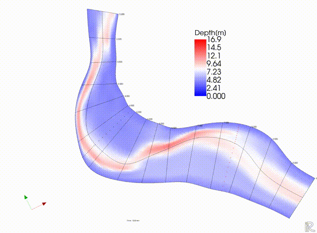

はじめに
============

Nays2d+はNays2dで得られる水深平均2次元流れの計算結果に対して、以下の手順で
疑似的な3次元流れ場を計算・表示するするソルバーである。

- 水深平均の流線を計算し。
- 流線の曲率半径を計算し。
- これと局所水深、局所水深平均流速から深さ方向の流速分布(流線方向と流線に直交する方向)を算定し、これを最終的にx,y方向の流れに戻して表示する。

本来の3次元モデルでは膨大な計算時間がかかるのに対して、
2次元計算と同じ計算時間で気軽に準3次元計算結果が、
それもかなりの信憑性を伴って得られるので、とっても便利なソルバーである。
流線の曲率から算出する2次流れの流速分布は `Engelund(1974) <https://cedb.asce.org/CEDBsearch/record.jsp?dockey=0022331>`_ 
の理論式を用いている. 
Nays2d+で使用されている基礎式は 
`こちら <https://i-ric.org/yasu/refs/SecondaryFlowEqs_JP.pdf>`_ である。
Nays2d+は `iRIC <https://i-ric.org/>`_ version 4.x以降のバージョンで動作可能である。

.. figure:: images/yasu.png
   :width: 200pt
   :target: https://rivmodel.rivpac.com/

.. figure:: images/iric.jpg
   :width: 200pt
   :target: https://i-ric.org/