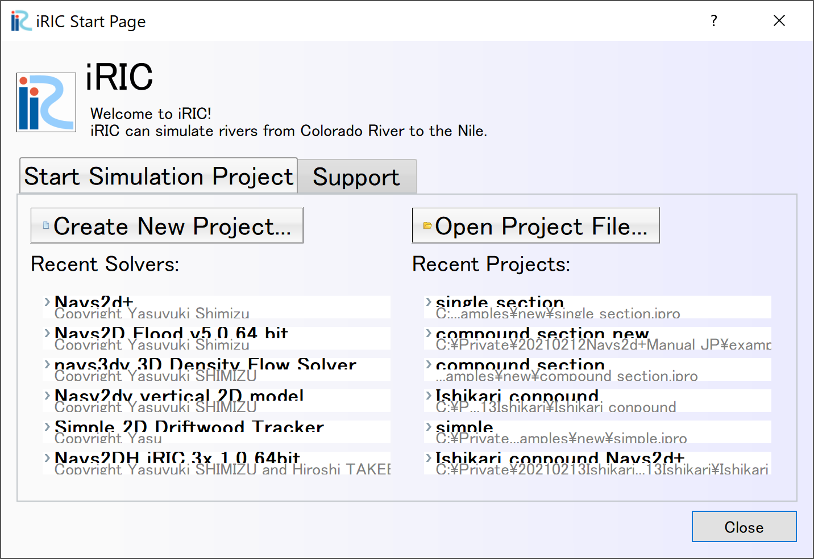
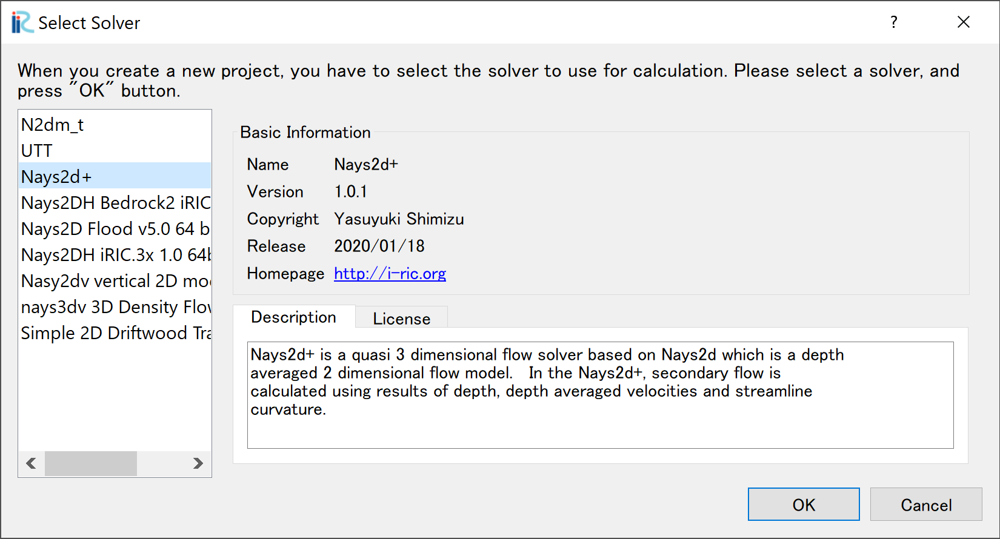
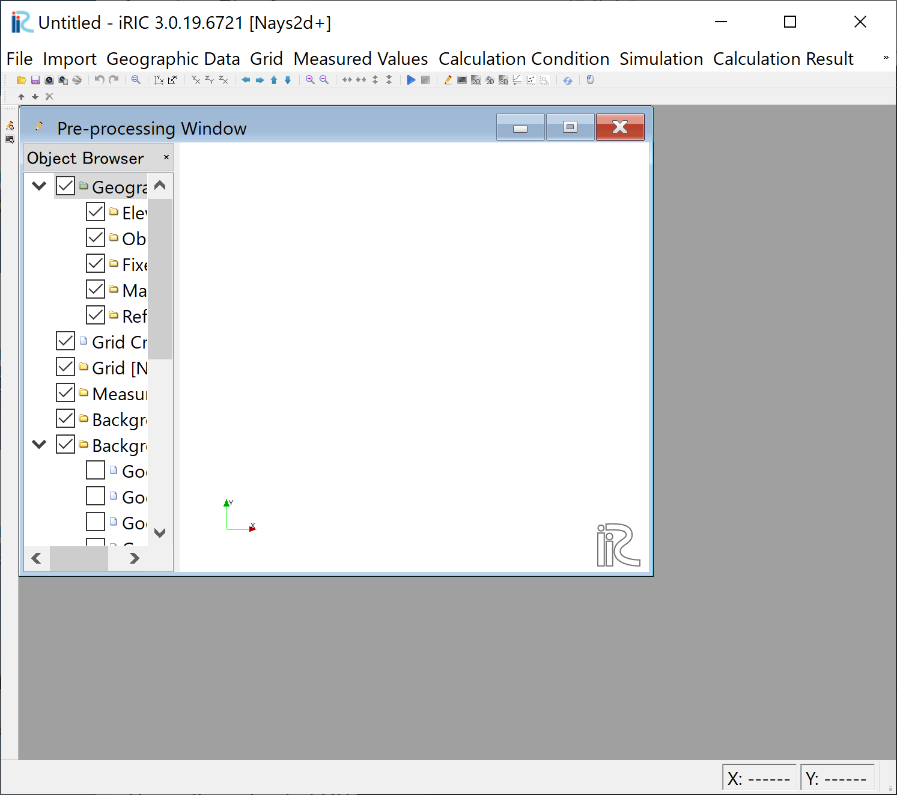

Overview
============

The main operating procedures for Nays2d+ are as follows:

Starting Nays2d+
------------------

The startup of Nays2d+ on iRIC is as follows.

Start iRIC and select [Create New Project(N)]

.. _image_create_new_project_1:

   : Create new project_1 

In the [Select Solver] window, :numref:`image_create_new_project_2` ,
Select [Nays2d+] and click [OK].

.. _image_create_new_project_2:

   : Create new project_2 

Untitled in title bar-iRIC 3.x.xx.xxxx
A screen with [Untitled - iRIC 3.x.xx.xxxx][Nasy2d+] appears
:numref:`image_create_new_project_4`.

.. _image_create_new_project_4:

   : Create new project_4

Preparations for using Nays2d+ are complete.

After this, the procedure is as follows.
The actual operation method will be explained in the Examples in the next chapter.

- Create computational grid

- Set computational condition

- Run the solver

- Show the results