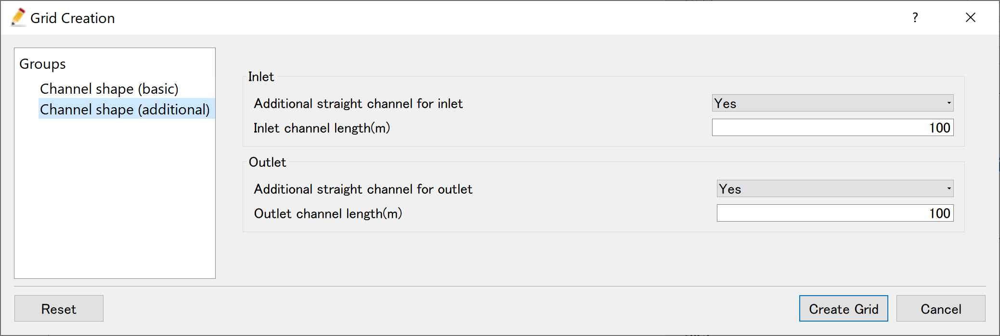
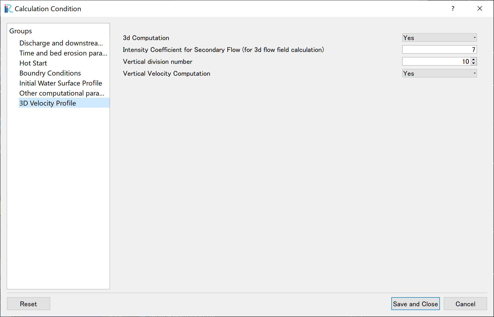
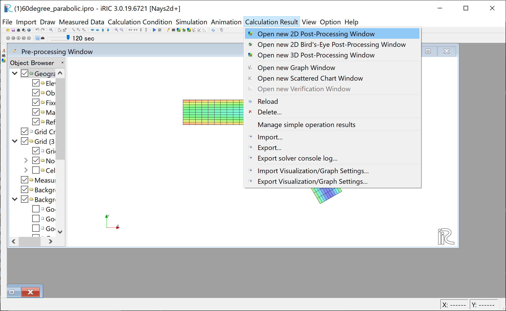
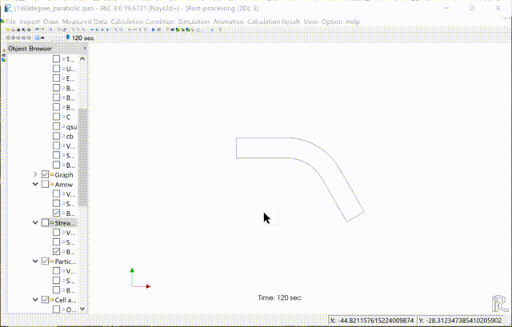
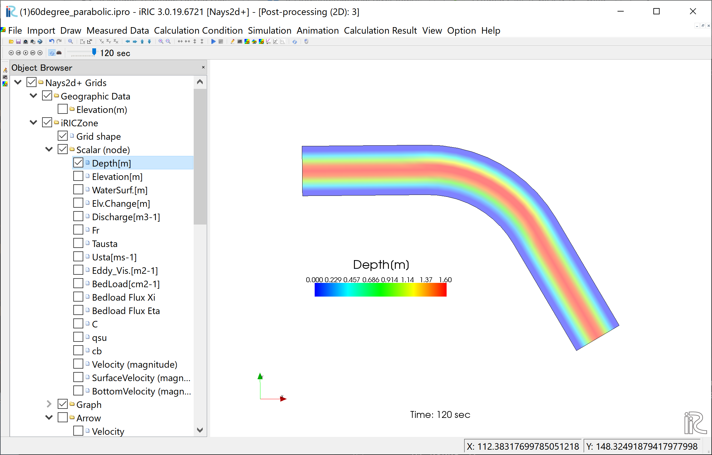
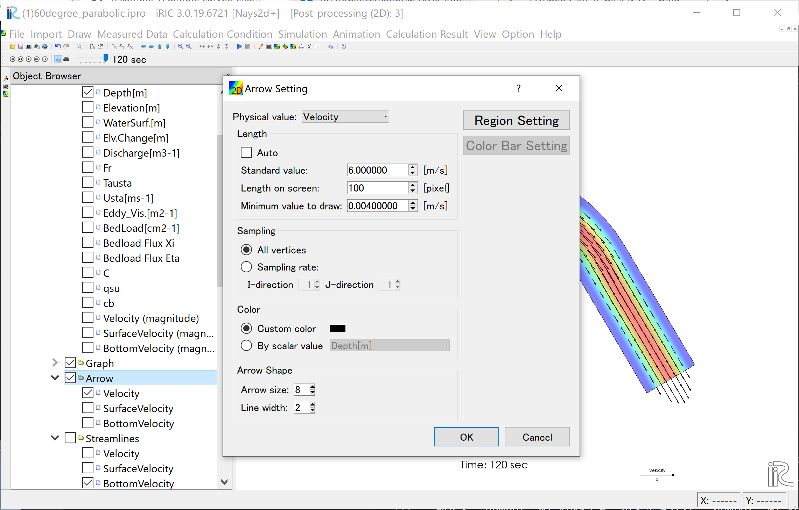
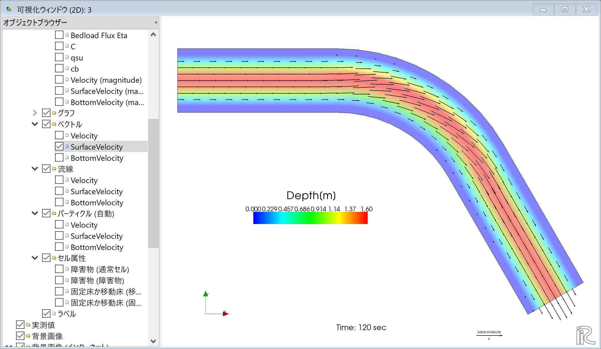

[計算例 1]60°単純曲線水路
==============================================

Nays2d+で簡単な湾曲水路の準3次元計算をします。

---------------
ソルバの選択
---------------

iRICの起動画面から、[新しいプロジェクト]を選ぶと表示されるソルバの選択画面で、
[Nays2d+ 簡単に3次元流れの計算ができます]を選んで[OK]ボタン押すと、

.. figure:: images/01/Select_solver.png
   :width: 80%

   : ソルバーの選択

「無題- iRIC 3.x.xxxx [Nays2d+ 簡単に3次元流れの計算ができます]」と書かれた
Windowが現れる。

.. _01_mudai:

.. figure:: images/01/mudai.png 
   :width: 90%

   : 無題

:numref:`01_mudai` 
のウィンドウで、[格子]→[格子生成アルゴリズムの選択]から現れる、
「格子生成アルゴリズムの選択」ウィンドウ で[2次元円弧形水路格子生成ツール]を選んで[OK]を押す。

.. _koushi_sentaku:

  : 格子生成アルゴリズムの選択

--------------
計算格子の作成
--------------

.. _01_koushi_1:

.. figure:: images/01/koushi_1.png
   :width: 90%

   :水路形状（基本設定）

:numref:`01_koushi_1` の画面で、「水路形状(基本形状)」を選択し、
「断面形状」を[放物線]、「砂州波高または放物線断面の中央部深(m)」を[4],
「水路中心の半径(m)」を[4]、「円弧の角度(度)」を[60]、「水路幅(m)」を[40]、
「流下方向格子サイズ(m)」を[10],「横断方向格子数」を[10]、「水路勾配」を[0.01]に
設定する。

.. _01_koushi_2:

   :水路形状（追加）設定

:numref:`01_koushi_2` の画面で、「流入部」「流出部」をいずれも[あり]、「長さ」を[10]mに
設定し、最後に[格子生成]ボタンを押す。

.. _01_koushi_3:

   :確認(マッピング)

すると、:numref:`01_koushi_3` 確認ウィンドウが現れるので,[はい(Y)]を押すと格子が生成され、
下図 :numref:`01_koushi_4` が表示される。

.. _01_koushi_4:

   :格子生成完了

ここで確認のためににオブジェクトブラウザーで「格子」「格子の属性」「河床高」にチックマークを付けて
表示させると :numref:`01_koushi_5` のように断面形が放物線形で上下流に直線部を伴う単純な曲線
水路が生成されたことが分かる。

.. _01_koushi_5:

   :格子生成完了

--------------
計算条件の設定
--------------

次に計算条件の設定を行う。メニューバーから「計算条件」→「設定」を選ぶと、
計算条件設定ウィンドウ :numref:`01_joken_1` が表示される。

.. _01_joken_1:

   :モデルパラメータ

:numref:`01_joken_2` の「流量および読み込みファイル」で[Edit]を
クックして、流量ハイドログラフ入力ウィンドウ :numref:`01_joken_3` に
移る。

.. _01_joken_2:

   :流量設定

.. _01_joken_3:

   :流量下流端水位設定ウィンドウ

:numref:`01_joken_3` において、「時間」「流量」のハイドログラフを入力する。
ここでは、0～120秒まで、120㎥/sの一定流量を与える。設定が終わったら[OK]を押して
ウィンドウを閉じる。

.. _01_joken_4:

.. figure:: images/01/joken_4.png
   :width: 90%

   :時間および浸食に関するパラメータ

「時間および浸食に関するパラメーター」は :numref:`01_joken_4` のように設定する。

.. _01_joken_5:

   :3次元流速分布

「ホットスタート」「境界条件」「水面形状」「他の計算条件」はデフォルトのままとし、
「3次元流速分布]は、 :numref:`01_joken_5` のように設定して
「保存して閉じる」をクリックする。

------------
計算の実行
------------

.. _01_keisan:

.. figure:: images/01/keisan.png
   :width: 90%

   :計算実行中の画面

[計算]→[実行]を指定すると、「保存しますか?」など聞かれるので、
特別な理由が無い限りは「はい(Y)」を選択すると、計算が実行され、
終了すると、:numref:`01_keisan` のような画面が現れる。
ここで、[OK]を押して、計算は終了となる。

-------------------------
計算結果の表示
-------------------------

計算の終了後、[計算結果]→[新しい可視化ウィンドウ(2D)を開く]を選ぶことによって、可視化ウィンドウが現れる。

.. _01_kekka_0:

   : 計算結果の表示(1)
 

「Ctrl」ボタンとマウス右ボタンを押しながらマウスを上下左右に動かすことによって、
3次元的な見え方が、また、マウスぼセンターダイヤを回すことにより、 :numref:`01_kekka_1` のような
拡大・縮小が可能となっている。

.. _01_kekka_1:

   : 3D格子の移動・拡大・縮小
 

^^^^^^^^^^^^^^^
水深の表示
^^^^^^^^^^^^^^^

オブジェクトブラウザーで、「スカラー(格子点)」の「Depth」に☑マークを入れて、
右クリックして[プロパティ]をクリックすると、
「スカラー設定」ウィンドウ :numref:`01_kekka_2` が現れる。

.. _01_kekka_2:

   : スカラーの設定
 
:numref:`01_kekka_2` の赤囲いの部分の設定をして、[OK]をクリックすると :numref:`01_kekka_3` 
が表示される。ここでカラーバーはオブジェクトブラウザーで「Depth」を押した状態で、
左マウスで移動出来る。縦横の変更も可能である。また、時刻表示のフォントの変更も
オブジェクトブラウザーの「時刻」「プロパティ」で可能である。( :numref:`01_kekka_4` 参照。)
。

.. _01_kekka_3:

   : 水深の表示
 
.. _01_kekka_4:

   : カラバーの移動と時刻表示のサイズ変更
 

^^^^^^^^^^^^^^^^^^^
流速ベクトルの表示
^^^^^^^^^^^^^^^^^^^

オブジェクトブラウザーで、[ベクトル][Velocity]に☑マーク入れて、
[ベクトル]をフォーカスさせてマウス右ボタン[プロパティ]をクリックすると、
「ベクトル設定」ウィンドウ :numref:`01_kekka_5` が現れる。ここで、赤丸の設定をして[OK]を
押すと :numref:`01_kekka_6` が表示される. :numref:`01_kekka_6` は水深平均流速ベクトルである。 

.. _01_kekka_5:

   : ベクトル設定
 
.. _01_kekka_6:

.. figure:: images/01/kekka_6.png
   :width: 450pt

   : 水深平均流速ベクトル表示
 
:numref:`01_kekka_6` の状態で、オブジェクトブラウザーの「ベクトル」の「SurfaceVelocity」に
☑マークを入れると「表面流速ベクトル」 :numref:`01_kekka_7` が、また、 「BottomVelocity」に☑マークを入れると
「底面近傍流速」 :numref:`01_kekka_8` が表示される。

.. _01_kekka_7:

   : 表面流速ベクトル表示
 
.. _01_kekka_8:

.. figure:: images/01/kekka_8.png
   :width: 450pt

   : 河床近傍流速ベクトル表示
 
:numref:`01_kekka_6` 、:numref:`01_kekka_7` ,　 :numref:`01_kekka_8` を比較すると、
明らかに水深平均流速は流路に平行、表面流速は外岸向き、底面流速は内岸向きになっており、
湾曲部の2次流が計算されていることが分かる。

^^^^^^^^^^^^^^^^^^^
流線の表示
^^^^^^^^^^^^^^^^^^^

オブジェクトブラウザーの「ベクトル」を一旦アンチェックし、「流線」に☑マークを入れる。
「Velocity」に☑マークを入れると「水深平均流速」による流線 :numref:`01_kekka_9` が、
「SurfaceVelocity」に☑マークを入れると「表面流速」による流線 :numref:`01_kekka_10` が、
「BottomVelocity」に☑マークを入れると「底面近傍流速」による流線 :numref:`01_kekka_11` が
表示される。

.. _01_kekka_9:

   : 水深平均流速による流線
 
.. _01_kekka_10:

.. figure:: images/01/kekka_10.png
   :width: 450pt

   : 表面流速による流線
 
 
.. _01_kekka_11:

.. figure:: images/01/kekka_11.png
   :width: 450pt

   : 河床近傍流速による流線
 
ベクトルと同様に、湾曲部の2次流の影響が計算されている。
