[Example 1] Simple curved channel with a 60 degree bend
===========================================================

-----------------
Select a solver
-----------------

From the [Select Solver] window, select [Nys2d+] and click [OK].

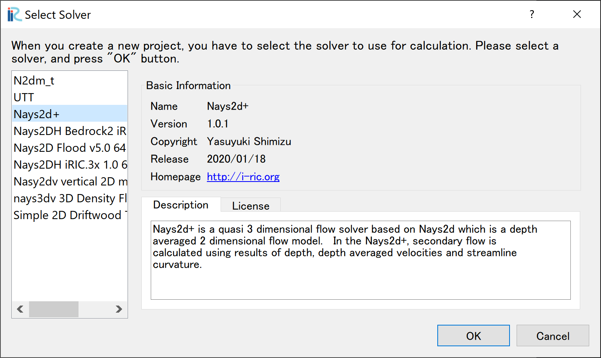

   : Select Solver

A window with [Untitled - iRIC 3.x.xxxx [Nays2d+]] appears.

.. _01_mudai:

   : Untitled

From the window, :numref:`01_mudai` ,select [Grid], [Select Algorithm to Create Grid].
Then the [Select Grid Creating Algorithm] window,  :numref:`koushi_sentaku` appears. 

.. _01_mudai_1:

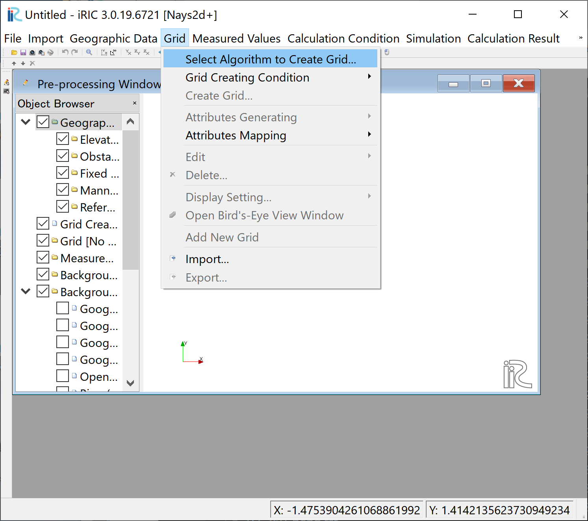

   : Select Algorithm t Create Grid

Select [2d arc grid generator], and push [OK]

.. _koushi_sentaku:

.. figure:: images/01/koushi_sentaku.png
  :width: 100%

  : Select Grid Creating Algorithm

---------------------------
Create Computational Grid
---------------------------

In the window, :numref:`01_koushi_1` , click [Channel shape (basic)], and 
set the values as show in :numref:`01_koushi_1` . 

.. _01_koushi_1:

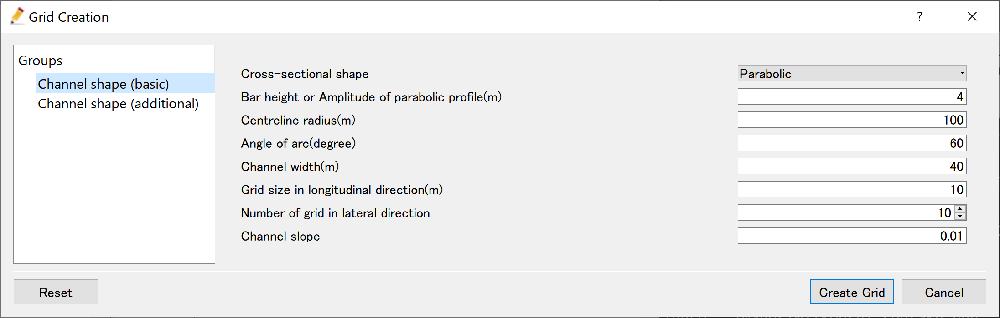

   :Channel shape (basic)

Select [Channel shape (additional)], set the values as shown in 
:numref:`01_koushi_2` , and click [Create Grid].

.. _01_koushi_2:

.. figure:: images/01/koushi_2.png
   :width: 100%

   :Channel shape (additional)

Then the [Conformation] window appears as :numref:`01_koushi_3` ,and 
click [Yes]. 

.. _01_koushi_3:

.. figure:: images/01/koushi_3.png
   :width: 60%

   :Confirmation for mapping

Then the following window,  :numref:`01_koushi_4` appears.

.. _01_koushi_4:

.. figure:: images/01/koushi_4.png
   :width: 100%

   :Computational Grid Completed

For the confirmation of mapping, add tick marks to "grid", "node attributes", and "Elevation(m)" 
in the object browser.
A channle with a simple curved channel with straight channels upstream and downstream 
with parabolic shape section as: numref:`01_koushi_5` is shown.

.. _01_koushi_5:

.. figure:: images/01/koushi_5.png
   :width: 100%

   :Confirmation of the mapping result

-----------------------------
Set Calculation Condition 
-----------------------------

From the main menu, select "Calculation conditions"-> "Settings" from the menu bar.

.. _01_joken_0:

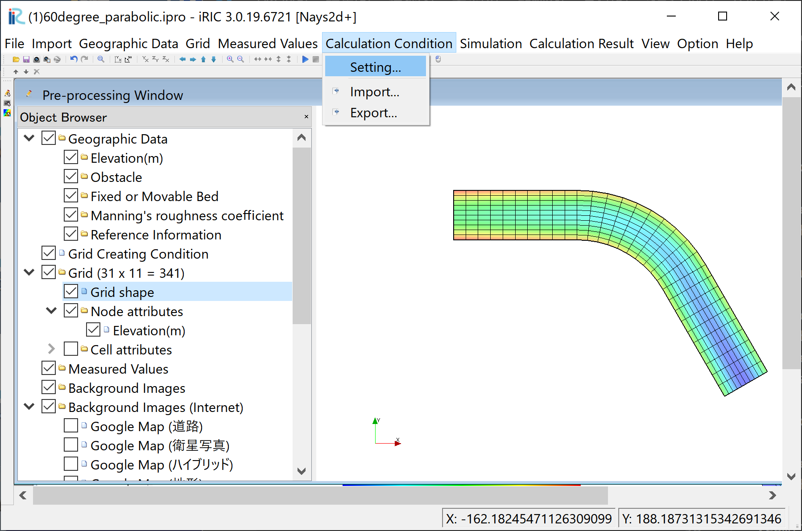

   :Calculation conditions setting

Then the calculation condition setting window :numref:`01_joken_1` is displayed.

.. _01_joken_1:

.. figure:: images/01/joken_1.png
   :width: 100%

   :Calculation condition

Click [Edit] in :numref:`01_joken_1` , 
and input dischrge hydrograph as shown in :numref:`01_joken_3` .
Then click [OK].

.. _01_joken_3:

.. figure:: images/01/joken_3.png
   :width: 100%

   :Time series of discharge input

Select [Time and bed erosion parameters] and set values as shown in :numref:`01_joken_4` .

.. _01_joken_4:

   :Setting of time and bed erosion parameters

Select [Other computational parameters] and set values as shown in :numref:`01_joken_5` .

.. _01_joken_5:

.. figure:: images/01/joken_5.png
   :width: 100%

   :Setting of Other computational parameters

Select [3D Velocity Profile] and set values as shown in :numref:`01_joken_6` .

.. _01_joken_6:

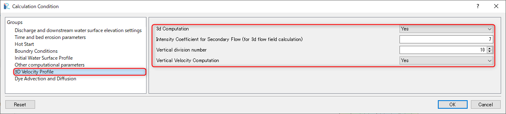

   :Setting of 3D velocity profile parameters

Finally, click [OK] and finish condition setting.

---------------------
Launch Computation
---------------------

From the main menu bar, select [Simulation],[Run].  Then if you are asked,
[This simulation already has results ...] as :numref:`01_keisan_0` , just reply
[OK] to continue.  

.. _01_keisan_0:

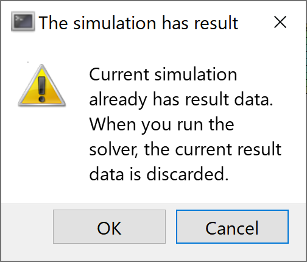

   :Warning message(1)

Then you are asked [.... Do you want to save?] as :numref:`01_keisan_1` .
Answer [Yes] or [No] depends on which you want, and the simulation starts as
:numref:`01_keisan`

.. _01_keisan_1:

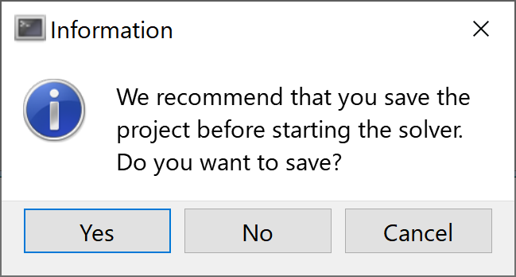

   :Warning message(2)

.. _01_keisan:

   :Simulation 

When the simulation finished.  A message [The solver finished calculation] appears as 
:numref:`01_keisan`.  Click [OK] and the simulation will finish.

.. _01_keisan_2:

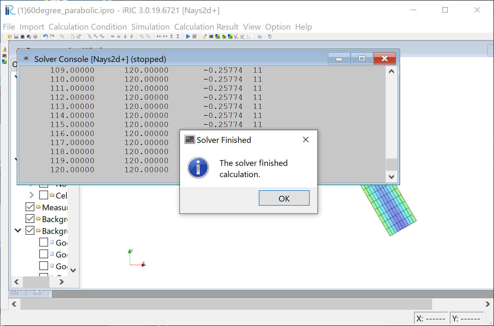

   :Simulation finished

---------------------------------
Display Computational Results
---------------------------------

After the companion finished, form the main menu, by selecting [Calculation Results] and 
[Open new 2D Post-Processing Window], a new Window appears as :numref:`01_kekka_0` .

.. _01_kekka_0:

.. figure:: images/01/kekka_0.png
   :width: 100%

   :2D Post-Processing Window
 

With holding down the "Ctrl" button and the right mouse button, you can move around
the object by moving the mouse up/down/left/right. 
It can also be enlarged and shrank by turning the mouse center diamond as,
:numref:`01_kekka_1` .

.. _01_kekka_1:

.. figure:: images/01/kekka_1.gif
   :width: 100%

   : Moving and resizing of the object image
 

^^^^^^^^^^^^^^^
Depth 
^^^^^^^^^^^^^^^

In the object browser, put the check marks in "Scalar (node)" and "Depth[m]",
right-click and select "Properties". 
The "Scalar Setting" window :numref:`01_kekka_2` appears.

.. _01_kekka_2:

.. figure:: images/01/kekka_2.png
   :width: 100%

   :Scalar Setting
 
Set the values as shown in :numref:`01_kekka_2`, and click [OK], then :numref:`01_kekka_3`
appears.

.. _01_kekka_3:

.. figure:: images/01/kekka_3.png
   :width: 100%

   : Depth Plot

^^^^^^^^^^^^^^^^^^^^
Velocity Vectors
^^^^^^^^^^^^^^^^^^^^

In the object browser, put the check marks in "Arrow" and "Velocity",
right-click and select "Properties". 
The "Arrow Setting" window :numref:`01_kekka_5` appears.
Set the values as :numref:`01_kekka_5`, and click [OK].  

.. _01_kekka_5:

.. figure:: images/01/kekka_5.png
   :width: 100%

   :Arrow Setting
 

:numref:`01_kekka_6` shows the depth-averaged velocity vectors. 

.. _01_kekka_6:

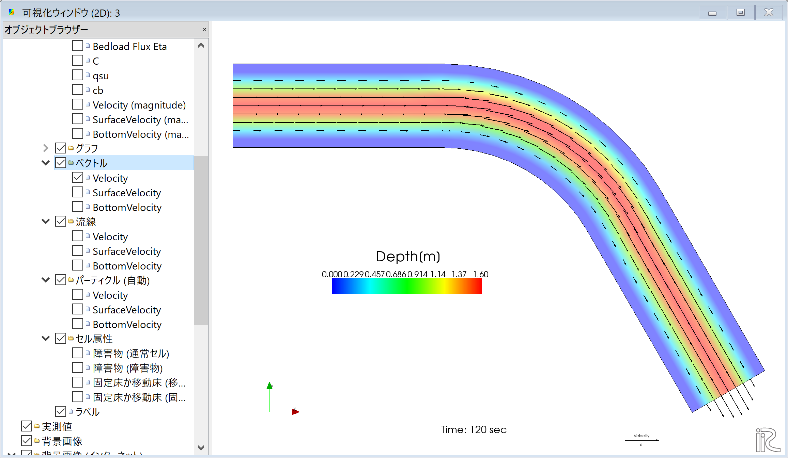

   :Depth Averaged Velocity Vectors
 

In :numref:`01_kekka_6`,  you can select "Surface Velocity" and "Bottom Velocity" by 
chekking each box in "Arrow" group. 

.. _01_kekka_7:

.. figure:: images/01/kekka_7.png
   :width: 100%

   : Surface Velocity Vectors
 
.. _01_kekka_8:

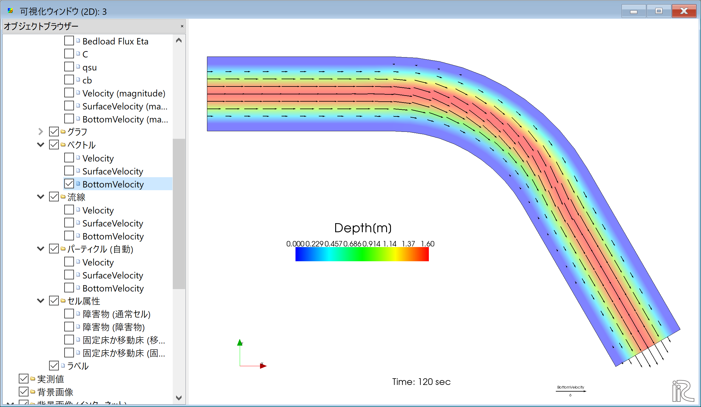

   : Bottom Velocity Vectors
 
It is obvious that, because of the secondly flow, 
the depth averaged velocity vectors are parallel to the channel banks, 
the surface velocity vectors are heading to outer bank, 
and the bottom velocity vectors are heading inner bank.

^^^^^^^^^^^^^^^^^^^
Stream Lines
^^^^^^^^^^^^^^^^^^^

Uncheck the box by "Arrow" in the Object Browser and check a box by "Streamline".
By checking "Velocity", 
the streamlines following the depth averaged flow velocity" :numref:`01_kekka_9` will be displayed.
By checking "Surface Velocity", 
the streamline following the surface velocity" :numref:`01_kekka_10` will be displayed.
By checking "Bottom Velocity", 
the streamline following the bottom velocity ne: numref:`01_kekka_11` will be displayed.

.. _01_kekka_9:

.. figure:: images/01/kekka_9.png
   :width: 100%

   :Streamlines by depth averaged velocity
 
.. _01_kekka_10:

   :Streamlines by surface velocity
 
 
.. _01_kekka_11:

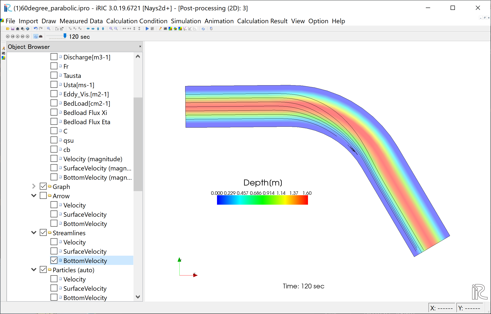

   :Streamlines by bottom velocities
 

The effect of the secondary flow is clearly shown.
