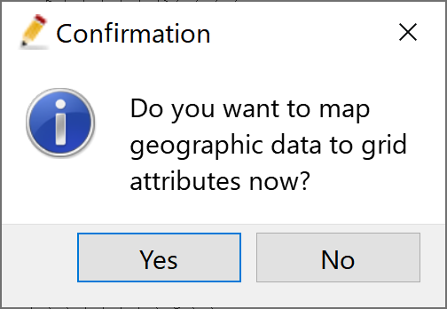
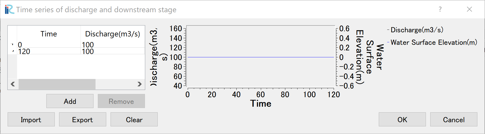
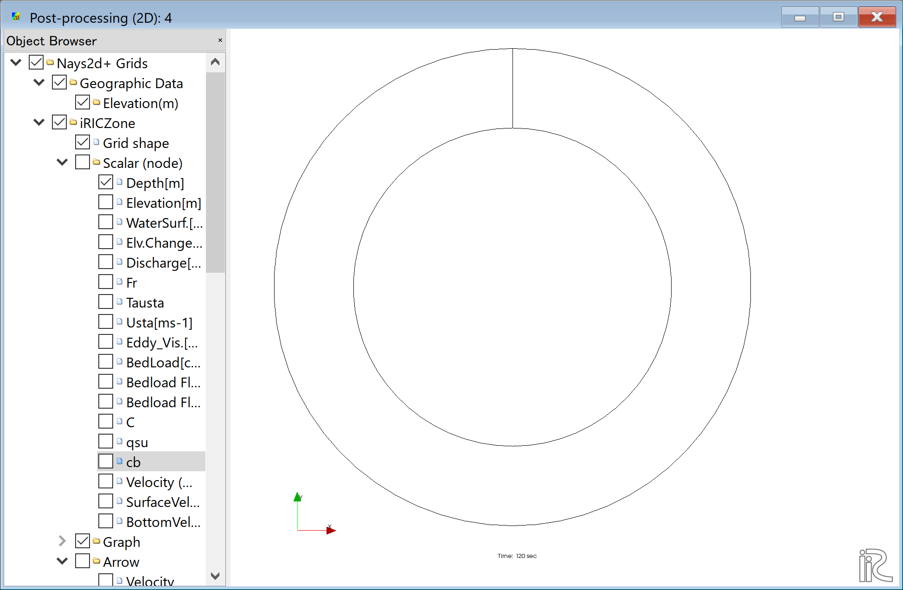
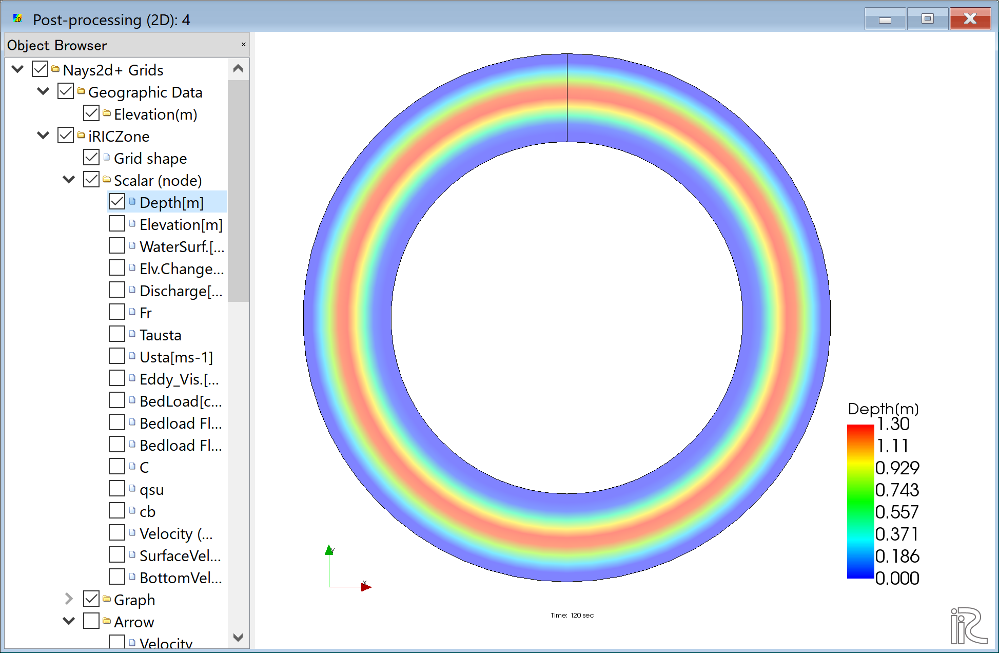
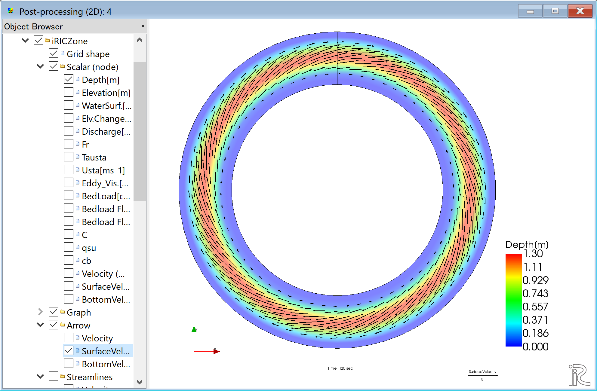
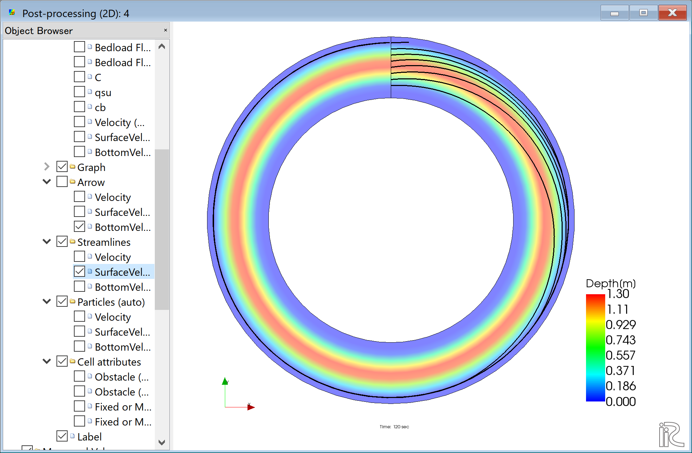

[計算例 2] 360°円形水路における流れ
====================================

Nays2d+を用いて、360°円形水路の流れの計算を行う。

--------------
計算格子の作成
--------------

計算格子の作成は[2次元円弧形水路格子生成ツール]を用いる。 :numref:`02_koushi_1` 
で[Nays3dv用格子生成ツール]を選択し。[OK]をクリックする。

.. _02_koushi_1:

.. figure:: images/02/koushi_1.png
   :width: 300pt

   : 格子生成アルゴリズムの選択

下図の :numref:`02_koushi_2` で赤囲いの部分を設定し、格子生成をクリックすると。 
:numref:`02_koushi_3` が表示され「マッピングを実行しますか？」と聞かれるので、
[はい(Y)]をクリックすると、格子が表示される。

.. _02_koushi_2:

.. figure:: images/02/koushi_2.png
   :width: 250pt

   : 格子生成: 水路形状（基本）

.. _02_koushi_3:

   : マッピングの実行

格子が表示されたら、「格子」「格子点の属性」「河床高」に☑マークを入れると
放物線断面で一定勾配の360°円形水路の格子が生成されたことが確かめられる。
( :numref:`02_koushi_4` )

.. _02_koushi_4:

.. figure:: images/02/koushi_4.png
   :width: 400pt

   : 格子生成の完了

--------------
計算条件の設定
--------------

メニューバーから[計算条件]→[設定]を選ぶと「計算条件」入力用のウィンドウが表示される 
( :numref:`02_joken_1` ) 

.. _02_joken_1:

   : 計算条件：モデルパラメータ

「計算条件」ウィンドウ :numref:`02_joken_1` の「流量および読み込みファイル」で
[Edit]をクリックし、

.. _02_joken_2:

   : 計算条件：流量ハイドログラフ設定

「流量ハイドログラフ設定」ウィンドウで :numref:`02_joken_2` のように設定するし、
[OK]をクリックする。

.. _02_joken_3:

   : 計算条件：時間および繰り返し計算パラメーター

「グループ」の「時間および浸食に関するパラメーター」は :numref:`02_joken_3` のように設定する。

.. _02_joken_4:

.. figure:: images/02/joken_4.png
   :width: 300pt

   : 計算条件：境界条件

「グループ」「境界条件」の「周期境界条件」は、無限に続く円形水路の計算なので、
「適用する」に設定する。

.. _02_joken_5:

.. figure:: images/02/joken_5.png
   :width: 300pt

   : 計算条件：3次元流速分布

「グループ」「3次元流速分布」の設定は :numref:`02_joken_5` のように設定して
「保存して閉じる」をクリックする。

------------
計算の実行
------------

.. _02_jikko_1:

.. figure:: images/02/jikko_1.png
   :width: 90%

   :計算実行中の画面

[計算]→[実行]を指定すると、:numref:`02_jikko_1` のような画面が現れ計算が始まる。

.. _02_jikko_2:

.. figure:: images/02/jikko_2.png
   :width: 90%

   :計算の終了

計算が終了すると, :numref:`02_jikko_2` のような表示がされる。

-------------------------
計算結果の表示
-------------------------

計算の終了後、[計算結果]→[新しい可視化ウィンドウ(2D)を開く]を選ぶことによって、可視化ウィンドウが現れる。

.. _02_kekka_1:

   : 計算結果の表示(1)
 
^^^^^^^^^^^^^^^
水深の表示
^^^^^^^^^^^^^^^

オブジェクトブラウザーで、「スカラー(格子点)」の「Depth」に☑マークを入れて、
右クリックして[プロパティ]をクリックすると、
「スカラー設定」ウィンドウ :numref:`02_kekka_2` が現れる。

.. _02_kekka_2:

   : スカラーの設定
 
:numref:`02_kekka_2` の赤囲いの部分の設定をして、[OK]をクリックすると 
:numref:`02_kekka_3` 

.. _02_kekka_3:

   : 水深の表示
 

^^^^^^^^^^^^^^^^^^^
流速ベクトルの表示
^^^^^^^^^^^^^^^^^^^

オブジェクトブラウザーで、[ベクトル][Velocity]に☑マーク入れて、
[ベクトル]をフォーカスさせてマウス右ボタン[プロパティ]をクリックすると、
「ベクトル設定」ウィンドウ :numref:`02_kekka_5` が現れる。ここで、赤丸の設定をして[OK]を
押すと :numref:`02_kekka_6` が表示される. :numref:`02_kekka_6` は水深平均流速ベクトルである。 

.. _02_kekka_5:

.. figure:: images/02/kekka_5.png
   :width: 250pt

   : ベクトル設定
 
.. _02_kekka_6:

   : 水深平均流速ベクトル表示
 
:numref:`02_kekka_6` の状態で、オブジェクトブラウザーの「ベクトル」の「SurfaceVelocity」に
☑マークを入れると「表面流速ベクトル」 :numref:`02_kekka_7` が、また、 「BottomVelocity」に☑マークを入れると
「底面近傍流速」 :numref:`02_kekka_8` が表示される。

.. _02_kekka_7:

   : 表面流速ベクトル表示
 
.. _02_kekka_8:

.. figure:: images/02/kekka_8.png
   :width: 450pt

   : 河床近傍流速ベクトル表示
 
:numref:`02_kekka_6` 、:numref:`02_kekka_7` ,　 :numref:`02_kekka_8` を比較すると、
明らかに水深平均流速は流路に平行、表面流速は外岸向き、底面流速は内岸向きになっており、
湾曲部の2次流が計算されていることが分かる。

^^^^^^^^^^^^^^^^^^^
流線の表示
^^^^^^^^^^^^^^^^^^^

オブジェクトブラウザーの「ベクトル」を一旦アンチェックし、「流線」に☑マークを入れる。
「Velocity」に☑マークを入れると「水深平均流速」による流線 :numref:`02_kekka_9` が、
「SurfaceVelocity」に☑マークを入れると「表面流速」による流線 :numref:`02_kekka_10` が、
「BottomVelocity」に☑マークを入れると「底面近傍流速」による流線 :numref:`02_kekka_11` が
表示される。

.. _02_kekka_9:

.. figure:: images/02/kekka_9.png
   :width: 450pt

   : 水深平均流速による流線
 
.. _02_kekka_10:

   : 表面流速による流線
 
 
.. _02_kekka_11:

.. figure:: images/02/kekka_11.png
   :width: 450pt

   : 河床近傍流速による流線
 
ベクトルと同様に、湾曲部の2次流の影響が計算されている。
