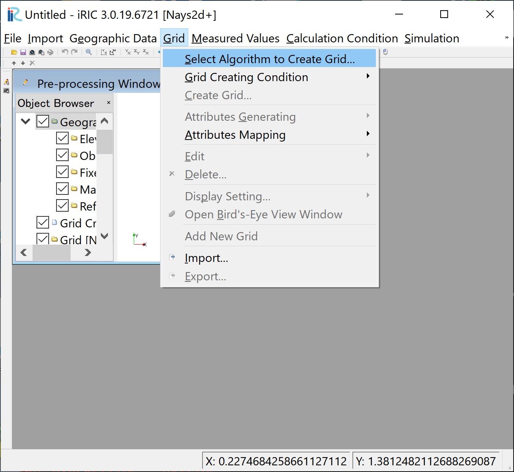
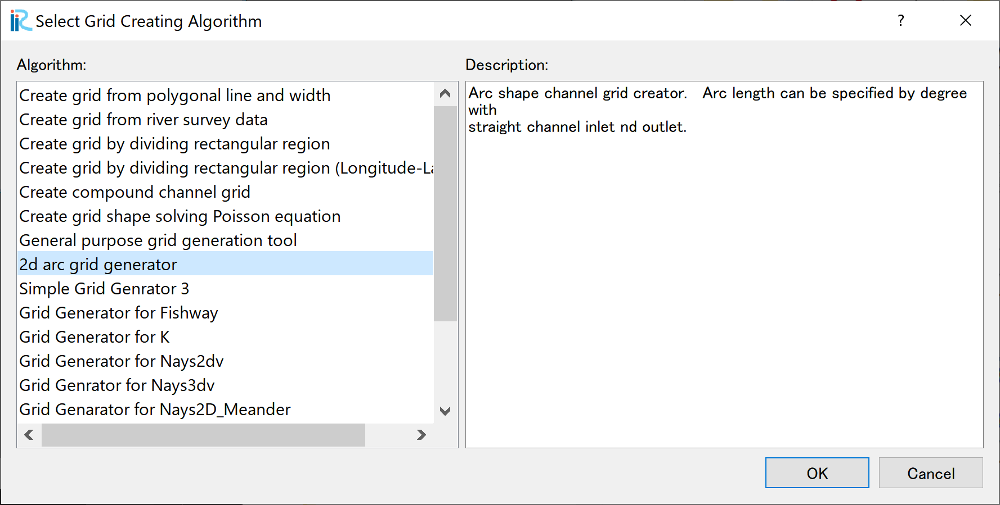
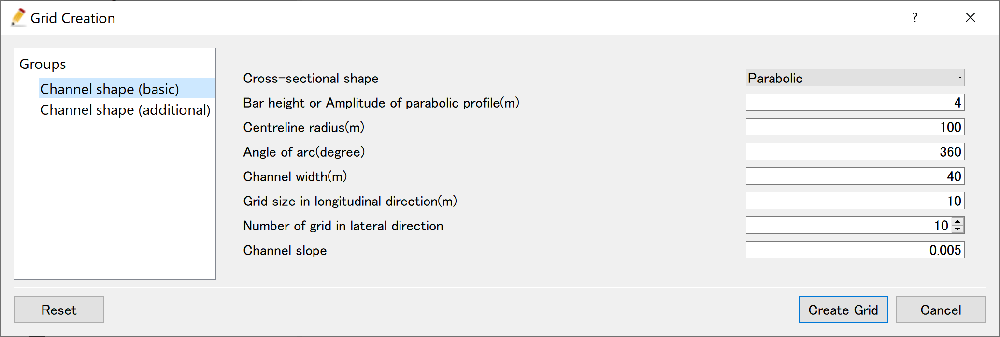
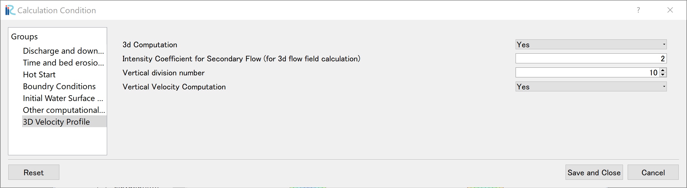
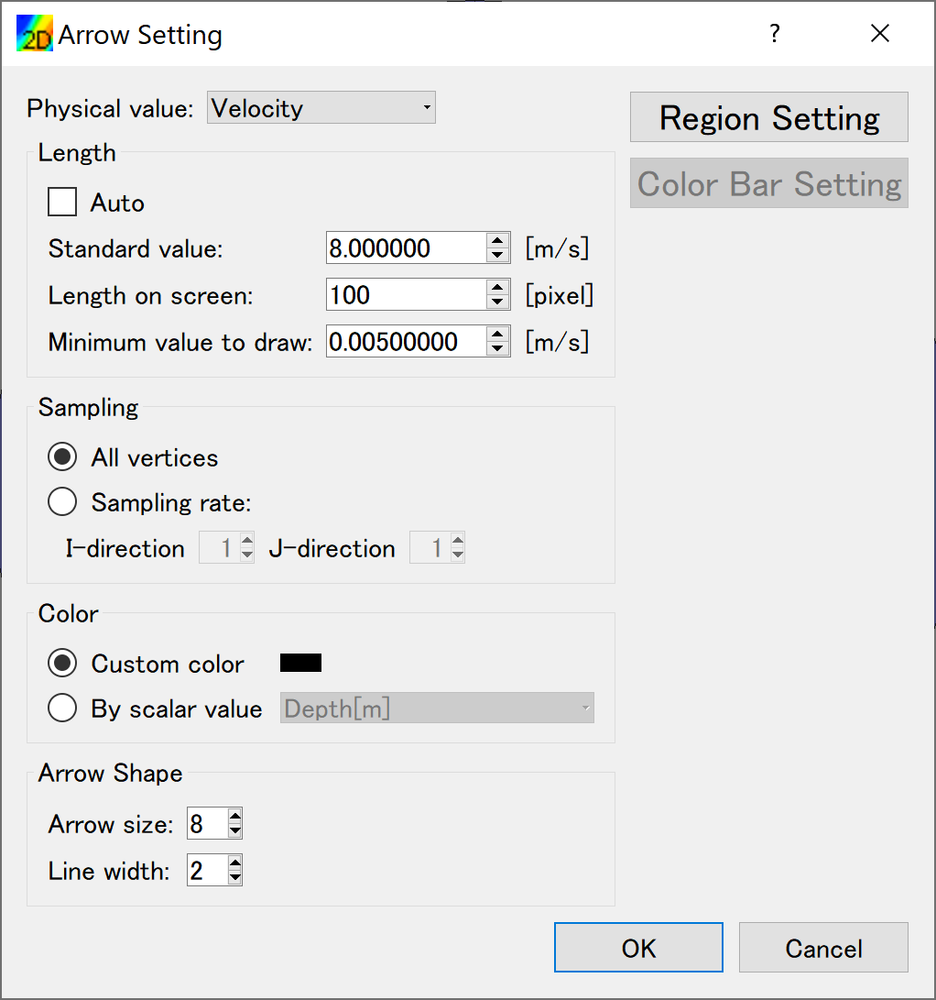
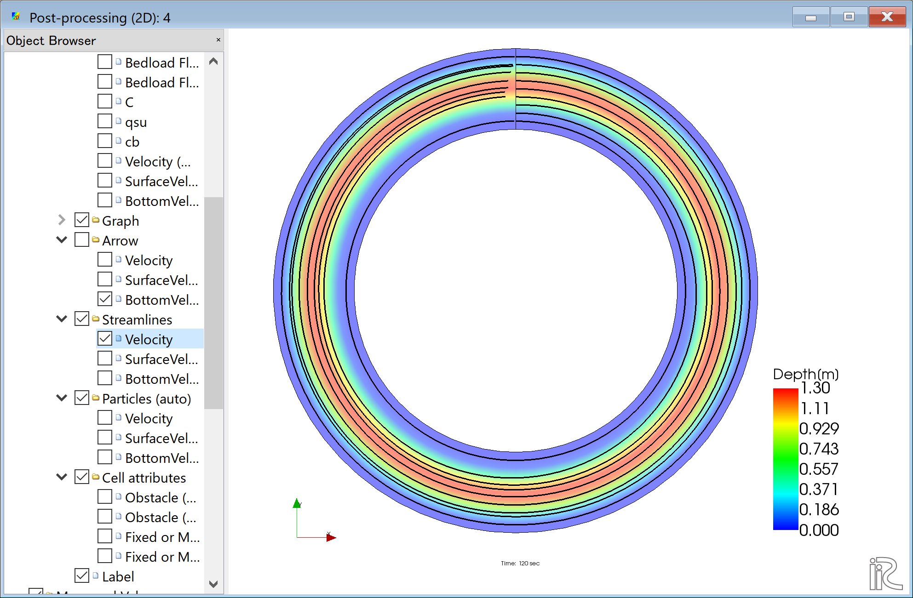
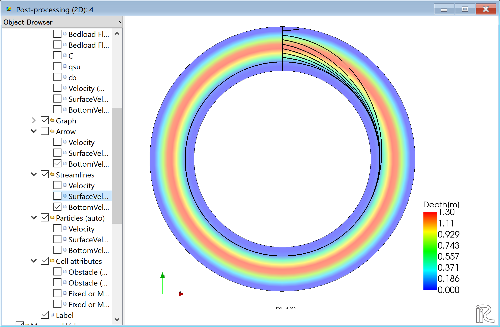

[Example 2] Flow in a 360 degree circle channel
===================================================

----------------------------
Create Computational Grid
----------------------------

.. _02_koushi_0:

   : Select Algorithm

From the main menu, select [Grid], [Select Algorithm to Create Grid]
( :numref:`02_koushi_0` )
Then the [Select Grid Creating Algorithm] window,  :numref:`02_koushi_1` appears. 
Select [2d arc generator] and click [OK]

.. _02_koushi_1:

   :Select Grid Creating Algorithm

Set values as shown in :numref:`02_koushi_2` , and click [OK].
Click [Yes] when you asked "Do you want to map data?" as
:numref:`02_koushi_3` .
Then the computational grid appears.

.. _02_koushi_2:

   : Grid Creation: Channel Shape (Basic)

.. _02_koushi_3:

.. figure:: images/02/koushi_3.png
   :width: 100pt

   : Mapping

Bed configuration can be confirmed by putting checking marks at, 
[Grid], [Node attributes] and [Elevation (m)].
( :numref:`02_koushi_4` )

.. _02_koushi_4:

   : Grid Creation Completed

------------------------
Computational Condition
------------------------

From the menu bar, select [Calculation Condition], [Settins] and
[Calculation Condition] window,  :numref:`02_joken_1` appears. 

.. _02_joken_1:

.. figure:: images/02/joken_1.png
   :width: 300pt

   : Calculation Condition: Groups

In :numref:`02_joken_1` , select [Discharge and downstream water surface elevation]
and click [Edit].

.. _02_joken_2:
 
.. figure:: images/02/joken_2.png
   :width: 300pt

   : Input discharge hydro graph

Input dischege hydrograph as shown in :numref:`02_joken_2` and click [OK].

.. _02_joken_3:

.. figure:: images/02/joken_3.png
   :width: 300pt

   : Time and bed erosion parameters

Select [Time and bed erosion parameters] and set values as :numref:`02_joken_3` .

.. _02_joken_4:

.. figure:: images/02/joken_4.png
   :width: 300pt

   : Boundary Condition

Set [Boundary Condition] as :numref:`02_joken_4`

.. _02_joken_5:

   : 3D Velocity Profile

Set [3D Velocity Profile] as :numref:`02_joken_5`, and click [Save and Close]

----------------------
Launch Computation
----------------------

.. _02_jikko_1:

.. figure:: images/02/jikko_1.png
   :width: 90%

   :Launch Computational

By selectng [Simulation] and [Run], a window as :numref:`02_jikko_1` appears,
and the simulations starts.

.. _02_jikko_2:

   :Simulation Fished

When the simulation finish, :numref:`02_jikko_2` appears.
Then click [OK].

-------------------------------
Display Computational Results
-------------------------------

After the companion finished, form the main menu, by selecting [Calculation Results] and 
[Open new 2D Post-Processing Window], a new Window appears as :numref:`02_kekka_1` .

.. _02_kekka_1:

.. figure:: images/02/kekka_1.png
   :width: 450pt

   :2D Post-Processing Window
 
^^^^^^^^^^^^^^^
Depth 
^^^^^^^^^^^^^^^

In the object browser, put the check marks in "Scalar (node)" and "Depth[m]",
right-click and select "Properties". 
The "Scalar Setting" window :numref:`02_kekka_2` appears.

.. _02_kekka_2:

.. figure:: images/02/kekka_2.png
   :width: 250pt

   :Scalar Setting
 
Set the values as shown in :numref:`02_kekka_2`, and click [OK], then :numref:`02_kekka_3`
appears.

.. _02_kekka_3:

.. figure:: images/02/kekka_3.png
   :width: 450pt

   : Depth Plot

^^^^^^^^^^^^^^^^^^^
Velocity vectors
^^^^^^^^^^^^^^^^^^^

In the object browser, put the check marks in "Arrow" and "Velocity",
right-click and select "Properties". 
The "Arrow Setting" window :numref:`02_kekka_5` appears.
Set the values as :numref:`02_kekka_5`, and click [OK].  

.. _02_kekka_5:

   :Arrow Setting
 

:numref:`02_kekka_6` shows the depth-averaged velocity vectors. 

.. _02_kekka_6:

.. figure:: images/02/kekka_6.png
   :width: 450pt

   :Depth Averaged Velocity Vectors
 

In :numref:`02_kekka_6`,  you can select "Surface Velocity" and "Bottom Velocity" by 
chekking each box in "Arrow" group. 

.. _02_kekka_7:

.. figure:: images/02/kekka_7.png
   :width: 450pt

   : Surface Velocity Vectors
 
.. _02_kekka_8:

   : Bottom Velocity Vectors
 

^^^^^^^^^^^^^^^^^^^
Stream Lines
^^^^^^^^^^^^^^^^^^^

Uncheck the box by "Arrow" in the Object Browser and check a box by "Streamline".
By checking "Velocity", 
the streamlines following the depth averaged flow velocity" :numref:`02_kekka_9` will be displayed.
By checking "Surface Velocity", 
the streamline following the surface velocity" :numref:`02_kekka_10` will be displayed.
By checking "Bottom Velocity", 
the streamline following the bottom velocity ne: numref:`02_kekka_11` will be displayed.

.. _02_kekka_9:

   :Streamlines by depth averaged velocity
 
.. _02_kekka_10:

.. figure:: images/02/kekka_10.png
   :width: 450pt

   :Streamlines by surface velocity
 
 
.. _02_kekka_11:

   :Streamlines by bottom velocities
 

The effect of the secondary flow is clearly shown.
