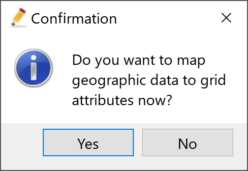
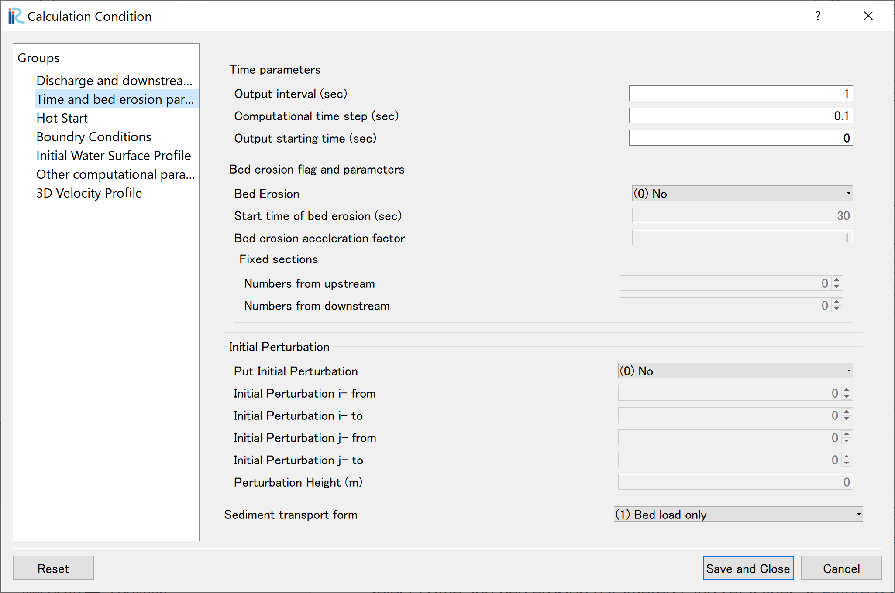
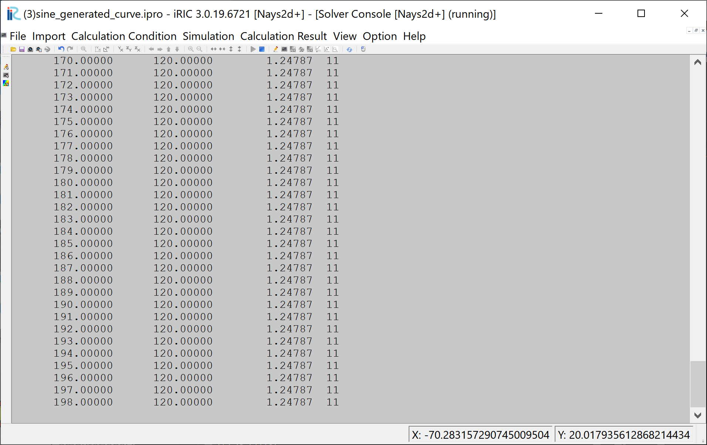
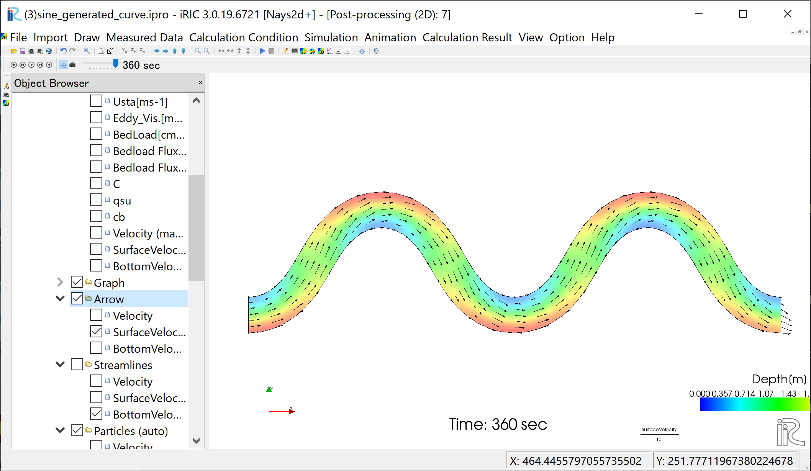
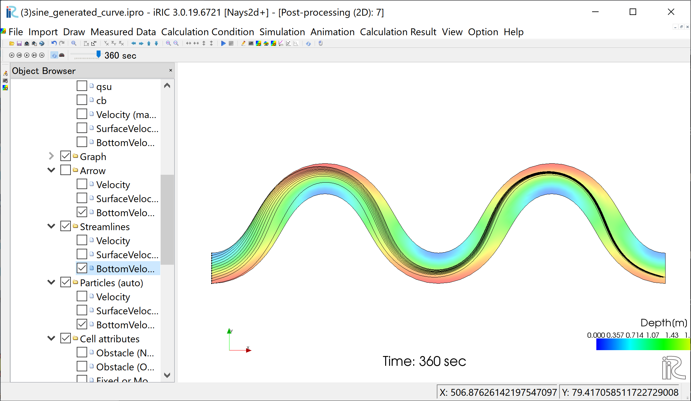
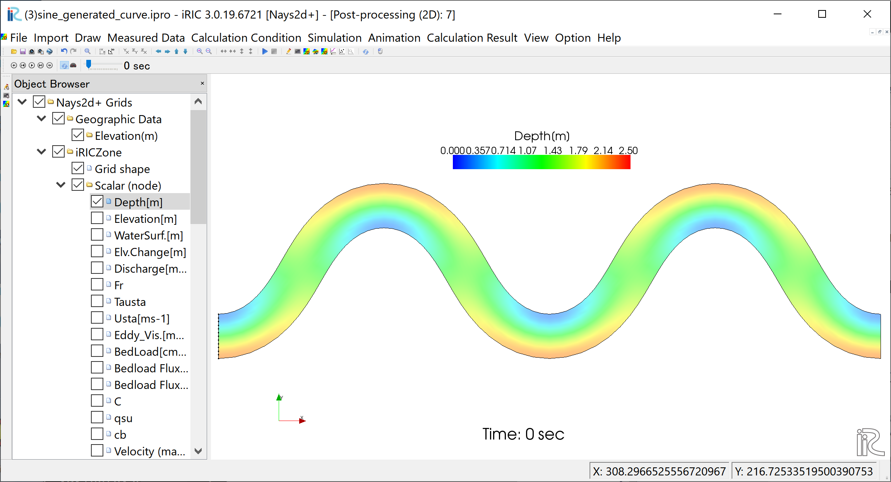
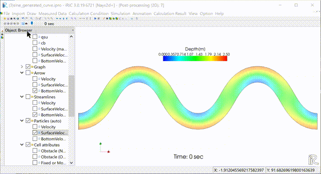
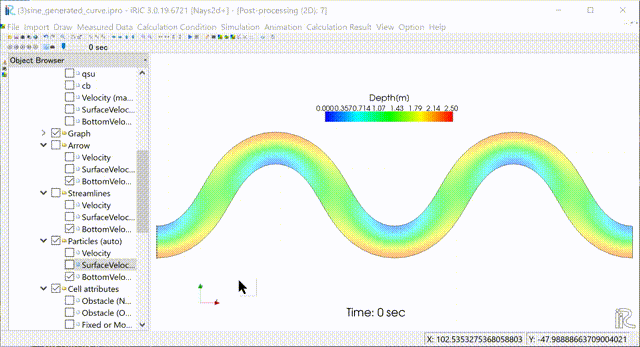

[計算例 3] Sine-Generated Curve蛇行水路における流れの計算
==========================================================

--------------
計算格子の生成
--------------

計算格子の作成は「簡易直線・蛇行生成ツール」を用いる。 :numref:`03_koshi_1` 
で示すように選択し。[OK]をクリックする。

.. _03_koshi_1:

   : 格子生成アルゴリズムの選択

下図の :numref:`03_koshi_2` で赤囲いの部分を設定する。 

.. _03_koshi_2:

.. figure:: images/03/koshi_2.png
   :width: 350pt

   : 格子生成: 水路形状

下図 :numref:`03_koshi_3` で赤囲いの部分を設定し、
格子生成をクリックすると、
:numref:`03_koshi_4` が現れ、「マッピングしますか？」と聞かれるので、
[はい(Y)]を選択すると、格子生成が完了する。

.. _03_koshi_3:

.. figure:: images/03/koshi_3.png
   :width: 350pt

   : 格子生成： 河床形状

.. _03_koshi_4:

   : マッピングしますか？

オブジェクトブラウザーで、「格子」「格子点の属性」「河床高」に☑マークを
入れると :numref:`03_koshi_5` のように、河床に砂州がある河床が形成された
ことが確認できる。

.. _03_koshi_5:

.. figure:: images/03/koshi_5.png
   :width: 350pt

   : 河床形状の確認

--------------
計算条件の設定
--------------

メニューバーから[計算条件]→[設定]を選ぶと「計算条件」
入力用のウィンドウが表示される（ :numref:`03_joken_1` ) 

.. _03_joken_1:

.. figure:: images/03/joken_1.png
   :width: 250pt

   : 計算条件：モデルパラメータ

「グループ」ウィンドウ :numref:`03_joken_1` の「流量および下流端水位の設定」
で「Edit」をクリックすると、 :numref:`03_joken_2` が現れるので、赤囲いの部分を
入力して、[OK]を押す。

.. _03_joken_2:

.. figure:: images/03/joken_2.png
   :width: 300pt

   : 計算条件：流量ハイドログラフの入力

「グループ」の「時間および浸食に関するパラメーター」は、
:numref:`03_joken_3` の赤囲いのように設定する。

.. _03_joken_3:

   : 計算条件：時間およに繰り返し計算パラメーター

「グループ」の「3次元流速分布」は、
:numref:`03_joken_4` の赤囲いのように設定する。
設定が終了したら、[保存して閉じる]をクリックして、計算条件の設定を終了する。

.. _03_joken_4:

.. figure:: images/03/joken_4.png
   :width: 300pt

   : 計算条件：3次元流速分布

------------
計算の実行
------------

.. _03_jikko_1:

   :計算実行中の画面

[計算]→[実行]を指定すると、:numref:`03_jikko_1` のような画面が現れ計算が始まる。

.. _03_jikko_2:

   :計算の終了

計算が終了すると, :numref:`03_jikko_2` のような表示がされるので、[OK]をクリックする。

-------------------------
計算結果の表示
-------------------------

計算の終了後、[計算結果]→[新しい可視化ウィンドウ(2D)を開く]を選ぶことによって、可視化ウィンドウ(3D)が現れる。

.. _03_kekka_1:

   : 計算結果の表示
 

「Ctrl」ボタンを押しながら左マウスを上下左右に動かすことによって移動、
マウスのセンターダイヤを回すことにより拡大・縮小が可能となっている。

^^^^^^^^^^^^^^^^^^^
水深コンターの表示
^^^^^^^^^^^^^^^^^^^
オブジェクトブラウザーで、「スカラー(格子点)」「Depth(m)」の「Depth」に☑マークを入れて、
「Depth(m)」を右クリック、「プロパティ」で現れる、「スカラー設定」ウィンドウ 
:numref:`03_kekka_2` を図のように設定して[OK]をクリックすると、水深分布のコンターマップ
:numref:`03_kekka_3` が表示される。ここでカラーバーはオブジェクトブラウザーで
「Depth」を押した状態で、右マウスで押さえながら移動したり、
縦横のレイアウトを変更したり出来る。
また、時間の表示はオブジェクトブラウザーで「時刻」を右クリックして「プロパティ」で
フォントやサイズを変更出来る。( :numref:`03_kekka_4` )参照。

.. _03_kekka_2:

.. figure:: images/03/kekka_2.png
   :width: 300pt

   : スカラーの設定
 
.. _03_kekka_3:

.. figure:: images/03/kekka_3.png
   :width: 450pt

   : 水深コンター
 

.. _03_kekka_4:

   : カラーバーの移動と時刻表示の変更
 

^^^^^^^^^^^^^^^^^^^^^^
流速ベクトルの表示
^^^^^^^^^^^^^^^^^^^^^^

オブジェクトブラウザーで、[ベクトル]、[Velocity]に☑マーク入れ、「ベクトル」
右クリック、「プロパティ」で
「ベクトル設定」ウィンドウ :numref:`03_kekka_5` が現れる。

.. _03_kekka_5:

.. figure:: images/03/kekka_5.png
   :width: 250pt

   : ベクトルの設定
 

:numref:`03_kekka_5` のようにベクトルに関する各パラメータを設定し、[OK]ボタンを押す。
と、水深平均流速ベクトルが表示される。（ :numref:`03_kekka_6` ）。

.. _03_kekka_6:

.. figure:: images/03/kekka_6.png
   :width: 450pt

   : 水深平均流速ベクトル図

ここで、「ベクトル」の「SurfaceVelocity」に☑マークを入れると、 :numref:`03_kekka_7` 
に示す表面流速ベクトル図、
「ベクトル」の「BottomVelocity」に☑マークを入れると、 :numref:`03_kekka_8` 
に示す底面近傍流速ベクトル図が表示される。

.. _03_kekka_7:

   :  表面流速ベクトル図

.. _03_kekka_8:

   : 底面近傍流速ベクトル図

^^^^^^^^^^^^^^^^^^^^^^^
流線の表示
^^^^^^^^^^^^^^^^^^^^^^^

オブジェクトブラウザーで、「ベクトル」の☑マークを外し、
「流線」「Velocity」に☑マークを入れると、水深平均流速による流線が表示される。
（ :numref:`03_kekka_9` ） 

.. _03_kekka_9:

.. figure:: images/03/kekka_9.png
   :width: 450pt

   : 水深平均流による流線
 
同様に、「SurfaceVelocity」に☑マークを入れると  :numref:`03_kekka_10` 
の表面流速による流線、
「BottomVelocity」に☑マークを入れると :numref:`03_kekka_11` 
の底面流速による流線が表示される。

.. _03_kekka_10:

.. figure:: images/03/kekka_10.png
   :width: 450pt

   :  表面流速による流線

.. _03_kekka_11:

   : 底面近傍流速による流線

^^^^^^^^^^^^^^^^^^^^^^^^^^^^^^^^^^^^^
パーティクル表示およびアニメーション
^^^^^^^^^^^^^^^^^^^^^^^^^^^^^^^^^^^^^

オブジェクトブラウザーで、「流線」の☑マークを外し、「パーティクル」
「Velocity]に☑マークを入れ、 :numref:`03_kekka_12` に示すように
タイムバーを0に戻して、プレイボタンを押すと、
:numref:`03_kekka_13` のように水深平均流速によるパーティクルアニメーションが表示
される。 

.. _03_kekka_12:

   : パーティクルアニメーションの開始
 

.. _03_kekka_13:

.. figure:: images/03/kekka_13.gif
   :width: 450pt

   : 水深平均流速によるパーティクルアニメーション

同様に、「SurfaceVelocity」に☑マークを入れると  :numref:`03_kekka_14` 
の表面流速によるパーティクルアニメーション、
「BottomVelocity」に☑マークを入れると :numref:`03_kekka_15` 
の底面流速による流線が表示される。

.. _03_kekka_14:

   :  表面流速によるパーティクルアニメーション

.. _03_kekka_15:

   : 底面近傍流速によるパーティクルアニメーション  
 
:numref:`03_kekka_13` ,  :numref:`03_kekka_14` , :numref:`03_kekka_15` を比較すると、
パーティクルは表面ほ外岸に向かい、底面ほど内岸に向かう湾曲部の2次流の特徴を良く表している。
