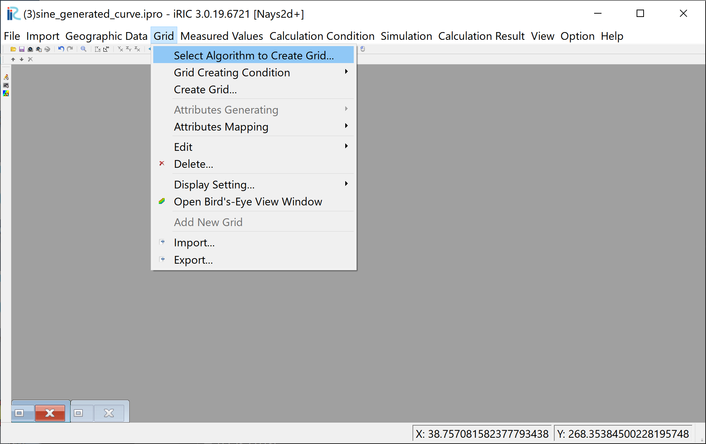
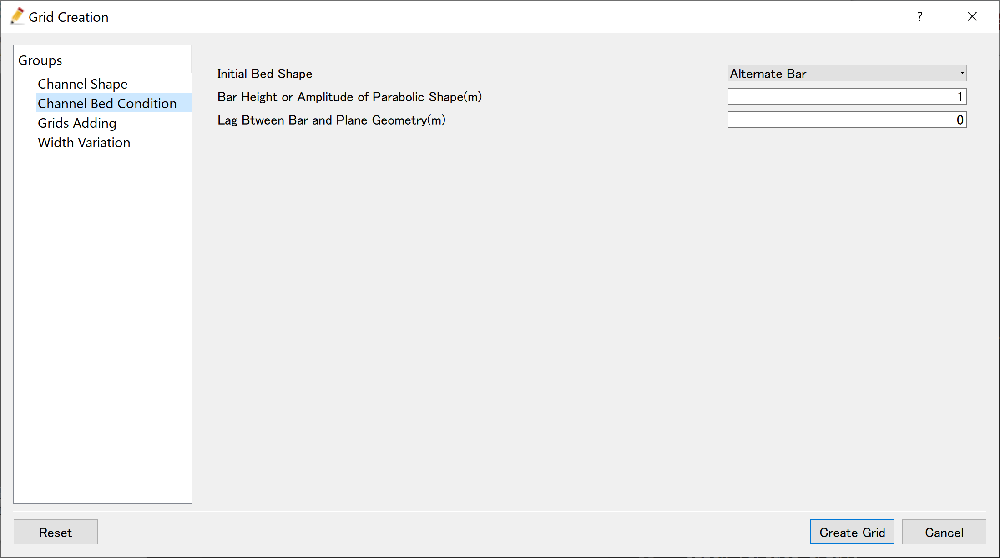
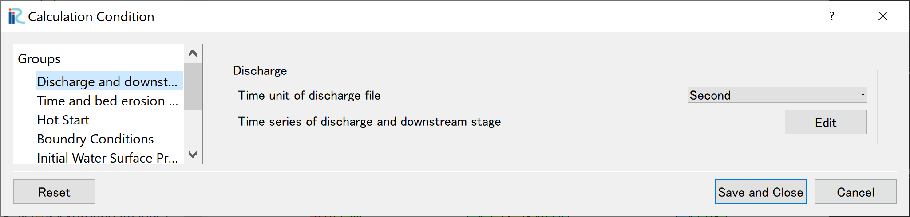
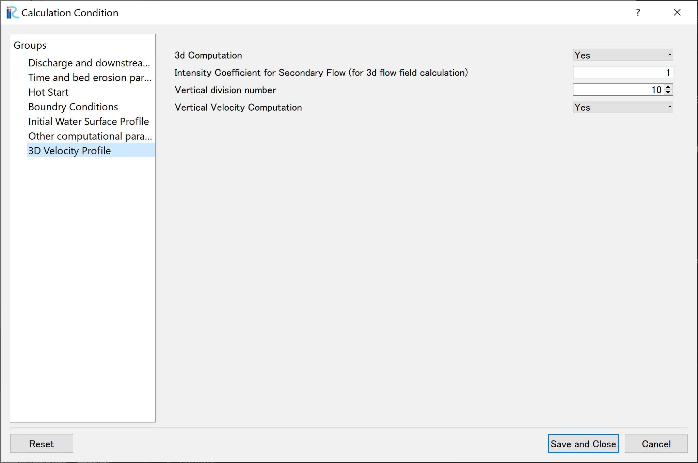
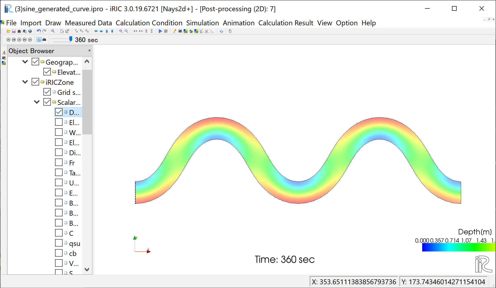
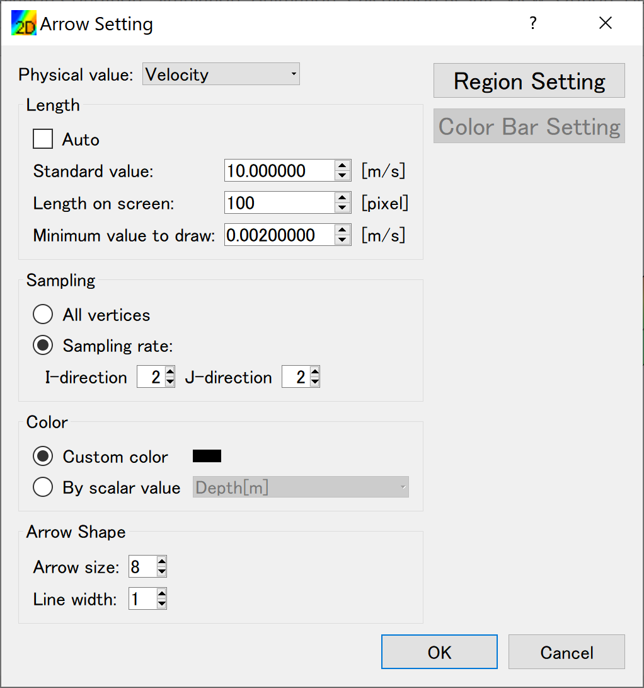
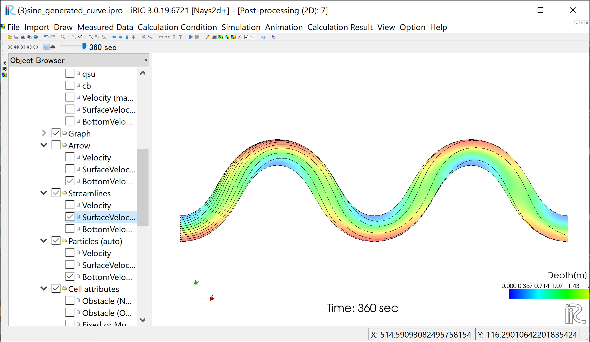

[Example 3] Flow in a Sine-Generated Curve Channel
==========================================================

---------------------------
Create Computational Grid
---------------------------

From the main menu, select [Grid], [Select Algorithm to Create Grid]
( :numref:`03_koshi_0` )

.. _03_koshi_0:

   : Select Algorithm to Create Grid

Select [Simple Grid Generator] in :numref:`03_koshi_1` , and click [OK]. 

.. _03_koshi_1:

.. figure:: images/03/koshi_1.png
   :width: 350pt

   : Select Grid Creation Algorithm

Set "Channel Shape" values as :numref:`03_koshi_2` 

.. _03_koshi_2:

.. figure:: images/03/koshi_2.png
   :width: 350pt

   : Grid Creation: Channel Shape

Set "Channel Bed Condition" values as :numref:`03_koshi_3` , and
click [Create Grid].
Click [Yes(Y)] when you are asked ":numref:`03_koshi_4` . 
Then the grid creation is completed.

.. _03_koshi_3:

   : Grid Creation: Channel Bed Condition

.. _03_koshi_4:

.. figure:: images/03/koshi_4.png
   :width: 130pt

   : Mapping？

Bed configuration and channel shape can be confirmed by putting checking marks at, 
[Grid], [Node attributes] and [Elevation (m)].
( :numref:`03_koshi_5` )

.. _03_koshi_5:

   : Grid Creation Completed

-------------------------
Computational Condition
-------------------------

From the menu bar, select [Calculation Condition], [Settings] and
[Calculation Condition] window,  :numref:`03_joken_1` appears. 

.. _03_joken_1:

   : Calculation Condition: Groups

In :numref:`03_joken_1` , select [Discharge and downstream water surface elevation]
and click [Edit].

.. _03_joken_2:
 
.. figure:: images/03/joken_2.png
   :width: 400pt

   : Input discharge hydro graph

Input discharge hydrograph as shown in :numref:`03_joken_2` and click [OK].

.. _03_joken_3:

.. figure:: images/03/joken_3.png
   :width: 400pt

   : Time and bed erosion parameters

Select [Time and bed erosion parameters] and set values as :numref:`03_joken_3` .

.. _03_joken_4:

   : 3D Velocity Profile

Set [3D Velocity Profile] as :numref:`03_joken_4`, and click [Save and Close]

----------------------
Launch Computation
----------------------

.. _03_jikko_1:

.. figure:: images/03/jikko_1.png
   :width: 90%

   :Launch Computational

By selecting [Simulation] and [Run], a window as :numref:`03_jikko_1` appears,
and the simulations starts.

.. _03_jikko_2:

.. figure:: images/03/jikko_2.png
   :width: 90%

   :Simulation Fished

When the simulation finish, :numref:`03_jikko_2` appears.
Then click [OK].

-------------------------------
Display Computational Results
-------------------------------

After the companion finished, form the main menu, by selecting [Calculation Results] and 
[Open new 2D Post-Processing Window], a new Window appears as :numref:`03_kekka_1` .

.. _03_kekka_1:

.. figure:: images/03/kekka_1.png
   :width: 450pt

   :2D Post-Processing Window
 
^^^^^^^^^^^^^^^
Depth 
^^^^^^^^^^^^^^^

In the object browser, put the check marks in "Scalar (node)" and "Depth[m]",
right-click and select "Properties". 
The "Scalar Setting" window :numref:`03_kekka_2` appears.

.. _03_kekka_2:

.. figure:: images/03/kekka_2.png
   :width: 250pt

   :Scalar Setting
 
Set the values as shown in :numref:`03_kekka_2`, and click [OK], then :numref:`03_kekka_3`
appears.

.. _03_kekka_3:

   : Depth Plot

^^^^^^^^^^^^^^^^^^^
Velocity vectors
^^^^^^^^^^^^^^^^^^^

In the object browser, put the check marks in "Arrow" and "Velocity",
right-click and select "Properties". 
The "Arrow Setting" window :numref:`03_kekka_5` appears.
Set the values as :numref:`03_kekka_5`, and click [OK].  

.. _03_kekka_5:

   :Arrow Setting
 

:numref:`03_kekka_6` shows the depth-averaged velocity vectors. 

.. _03_kekka_6:

.. figure:: images/03/kekka_6.png
   :width: 450pt

   :Depth Averaged Velocity Vectors
 

In :numref:`03_kekka_6`,  you can select "Surface Velocity" and "Bottom Velocity" by 
checking each box in "Arrow" group. 

.. _03_kekka_7:

.. figure:: images/03/kekka_7.png
   :width: 450pt

   : Surface Velocity Vectors
 
.. _03_kekka_8:

.. figure:: images/03/kekka_8.png
   :width: 450pt

   : Bottom Velocity Vectors
 

^^^^^^^^^^^^^^^^^^^
Stream Lines
^^^^^^^^^^^^^^^^^^^

Uncheck the box by "Arrow" in the Object Browser and check a box by "Streamline".
By checking "Velocity", 
the streamlines following the depth averaged flow velocity" :numref:`03_kekka_9` will be displayed.
By checking "Surface Velocity", 
the streamline following the surface velocity" :numref:`03_kekka_10` will be displayed.
By checking "Bottom Velocity", 
the streamline following the bottom velocity ne: numref:`03_kekka_11` will be displayed.

.. _03_kekka_9:

   :Streamlines by depth averaged velocity
 
.. _03_kekka_10:

   :Streamlines by surface velocity
 
 
.. _03_kekka_11:

.. figure:: images/03/kekka_11.png
   :width: 450pt

   :Streamlines by bottom velocities
 

The effect of the secondary flow is clearly shown.

^^^^^^^^^^^^^^^^^^^^^^^
Particle Animation
^^^^^^^^^^^^^^^^^^^^^^^

In the object browser, uncheck the box of [Streamlines], and check the boxes of
[Particles] and [Velocity], and set the time bar back to zero, as shown in
:numref:`03_kekka_12` 
Click small black play button, and particle animation starts as 
:numref:`03_kekka_13`, which shows the particles following depth averaged flow.

.. _03_kekka_12:

.. figure:: images/03/kekka_12.png
   :width: 450pt

   : Starting of Particle Animation
 

.. _03_kekka_13:

   : Animation of particles following the depth averaged velocity 

In the same way, the particle flowing animations can be played by 
checking a box at [Surface Velocity], and [Bottom Velocity], respectively.

.. _03_kekka_14:

.. figure:: images/03/kekka_14.gif
   :width: 450pt

   : Animation of particles following the surface velocity

.. _03_kekka_15:

.. figure:: images/03/kekka_15.gif
   :width: 450pt

   : Animation of particles following the bottom velocity
 
