[Example 4] Flow in a real river（single cross section)
============================================================================

----------------
Select Solver
----------------

In the [Select Solver] window, :numref:`04_koshi_1` , select [Nays2d+] and click [OK].

.. _04_koshi_1:

.. figure:: images/04/koshi_1.png
   :width: 250pt

   : Select Solver

-----------------------------------------
Importing River Survey Data
-----------------------------------------

In the window, :numref:`04_koshi_2`, select [Import], [Geographic Data], [Elevation(m)]

.. _04_koshi_2:

.. figure:: images/04/koshi_2.png
   :width: 250pt

   : Import river geographic data
   
   

Chose [single.riv] in the window, :numref:`04_koshi_3` and open.
The cross sectional survey data "single.riv" can be downloaded from，
https://i-ric.org/yasu/fw/rivfiles/single.riv 

.. _04_koshi_3:

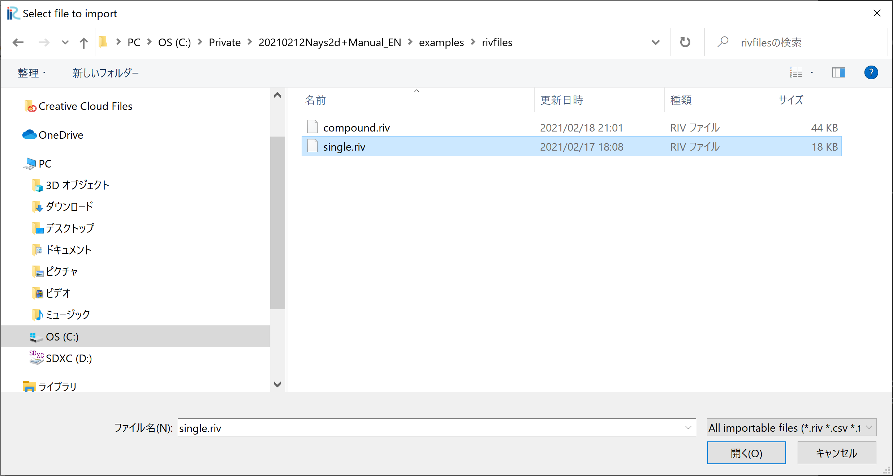

   : Select File

A message window may appear telling "Problems Fund i Data" as 
:numref:`04_koshi_4` ,but just click [OK]

.. _04_koshi_4:

.. figure:: images/04/koshi_4.png
   :width: 250pt

   : Prblem Fund

Select [Middle point of left and right bank] in the 
[River Survey Data Import Setting] window as :numref:`04_koshi_5` ,
and click [OK]

.. _04_koshi_5:

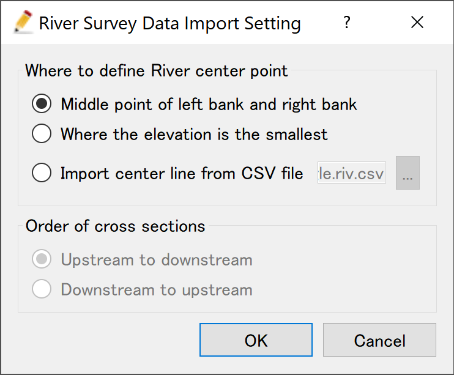

   : River Survay Data Import Setting

:numref:`04_koshi_6` riv file import complete.

.. _04_koshi_6:

.. figure:: images/04/koshi_6.png
   :width: 450pt

   : Import Complete

-----------------------------
Grid Generation Conditions
-----------------------------

From the main menu, select [Grid] and [Select Algorithm to Create Grid] as, 
:numref:`04_koshi_7` 

.. _04_koshi_7:

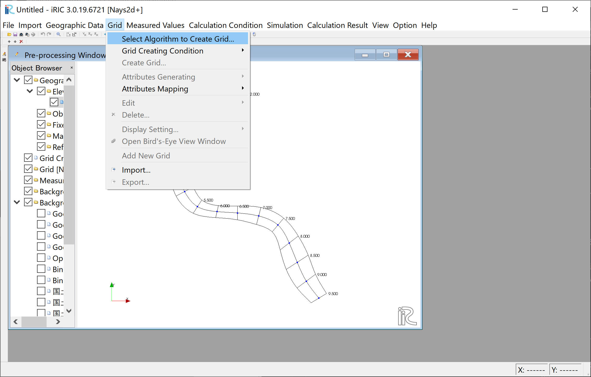

   : Select Algorithm to Create Grid

Select [Create grid from river survey data] from the window, :numref:`04_koshi_8` ,
and click [OK].

.. _04_koshi_8:

.. figure:: images/04/koshi_8.png
   :width: 450pt

   : Create grid from river survey data

As shown in :numref:`04_koshi_9` , a channel with cross sections with both ends' 
blue circles are displayed.

.. _04_koshi_9:

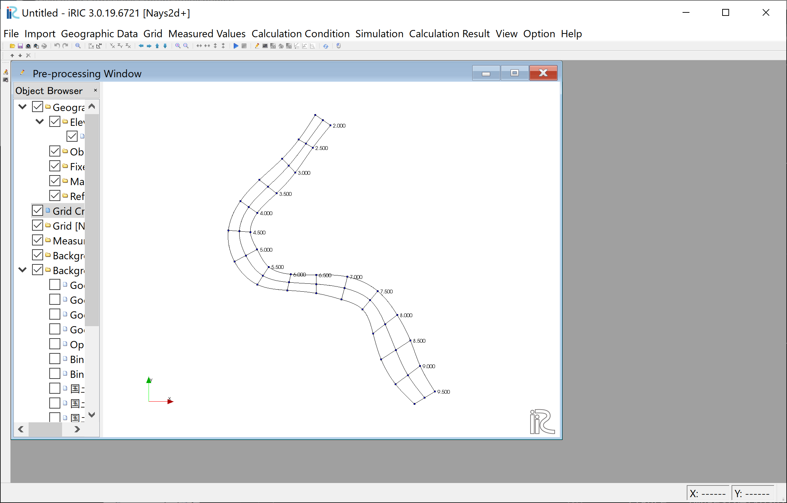

   : Setting Grid Create Condition Complete

-------------------------
Grid Generation
-------------------------

Select any side of one of the cross section line, right click, and chose
[Add Division Points].

.. _04_koshi_10:

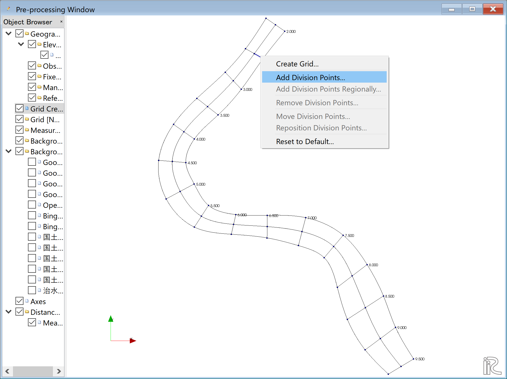

   :Add Division Points(1)

Set [Division Number], set [4] in this example, and
click [OK] (:numref:`04_koshi_11` )

.. _04_koshi_11:

.. figure:: images/04/koshi_11.png
   :width: 450pt

   :Add Division Points(2)

Select one of the opposite side of the cross sectional line we 
selected in :numref:`04_koshi_10` , right click, and chose
[Add Division Points] (:numref:`04_koshi_12` )

.. _04_koshi_12:

.. figure:: images/04/koshi_12.png
   :width: 450pt

   :Add Division Points(3)

Set [Division Number], set [4] as a same number we set in 
:numref:`04_koshi_11` for the symmetry.

.. _04_koshi_13:

.. figure:: images/04/koshi_13.png
   :width: 450pt

   :Add Division Points(4)

Along the channel direction, division points are set all at once.
Select [Grid], [Add Division Points Regionally] from the menu bar.
( :numref:`04_koshi_14` )

.. _04_koshi_14:

.. figure:: images/04/koshi_14.png
   :width: 450pt

   :Add Division Points Regionally(1)

Chose [Specify target distance division points]. set distance [70] in this example,
and click [OK]．( :numref:`04_koshi_15` )

.. _04_koshi_15:

   :Add Division Points Regionally(2)

When the setup for division points are completed, 
a plane map with yellow circle points appears as
:numref:`04_koshi_16`

.. _04_koshi_16:

.. figure:: images/04/koshi_16.png
   :width: 450pt

   :Set dicision points complete

Select [Grid], [Grid Create] from the menu bar.( :numref:`04_koshi_17` )

.. _04_koshi_17:

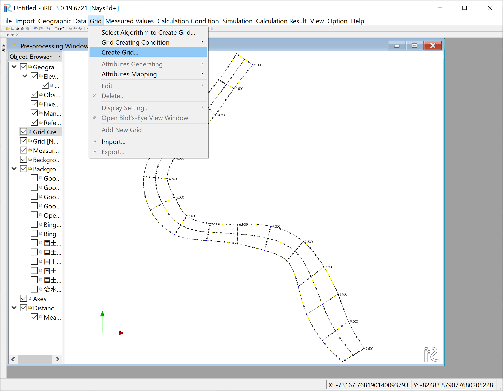

   :Grid Create(1)

Confirm the grid generation range painted with blue, and 
click [OK].

.. _04_koshi_18:

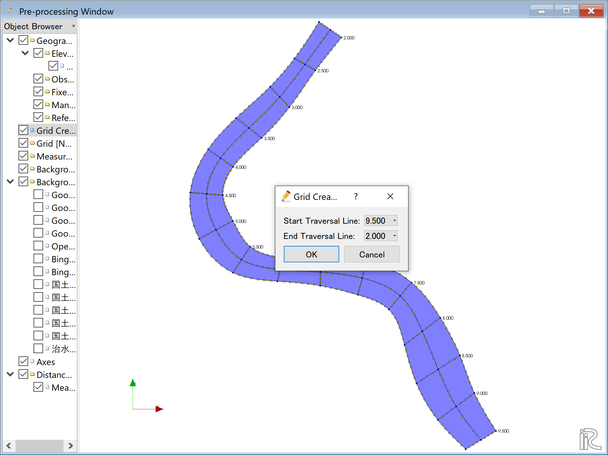

   :Grid Create(2)

Answer [Yes] when you asked [Do you want to map?] as
:numref:`04_koshi_19` 

.. _04_koshi_19:

.. figure:: images/04/koshi_19.png
   :width: 450pt

   :Mapping?

Completed grid is shown as :numref:`04_koshi_20` 

.. _04_koshi_20:

   :Grid Generation Complete

Bed configuration and channel shape can be confirmed by putting checking marks at, 
[Grid], [Node attributes] and [Elevation (m)].
( :numref:`04_koshi_21` )

.. _04_koshi_21:

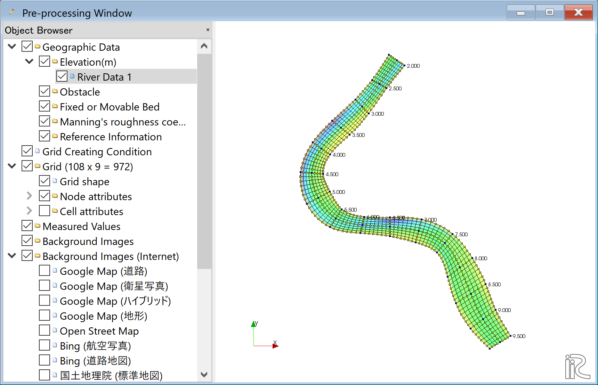

   :Confirmtion of the Mapping Result

------------------------
Computational Condition
------------------------

Select [Calculation Condition] and [Setting] from the min menu as
:numref:`04_joken_01` .

.. _04_joken_01:

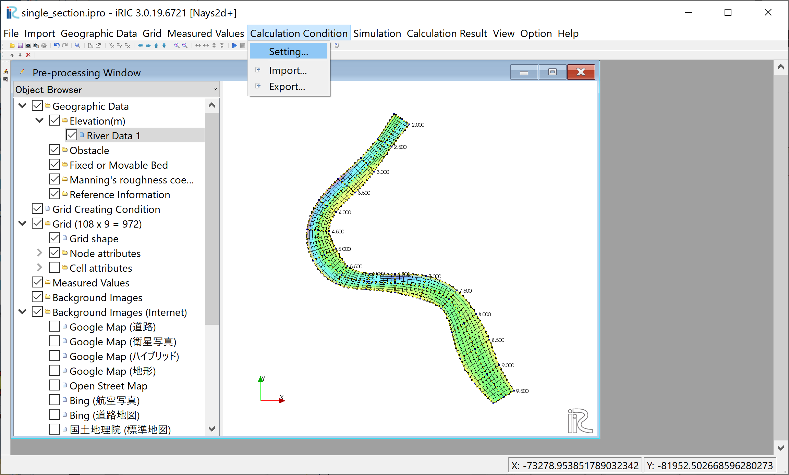

   :Setting Compitational Condition

Set [Time unit of discharge] as [Hour] and click [Edit], 
( :numref:`04_joken_02` )

.. _04_joken_02:

.. figure:: images/04/joken_02.png
   :width: 450pt

   :Discharge Condition

Set discharge hydrography as :numref:`04_joken_03`, constant for 3 hours 
with 2,000 qms, and click [OK].

.. _04_joken_03:

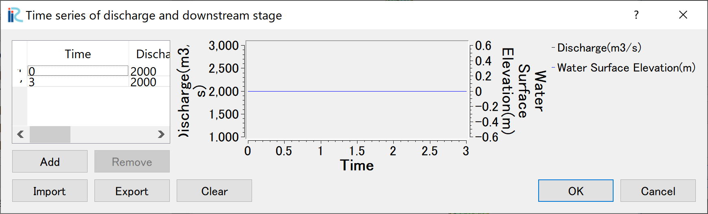

   :Input Discharge(2)

Set [Time and bed erosion condition] as :numref:`04_joken_04` .

.. _04_joken_04:

.. figure:: images/04/joken_04.png
   :width: 400pt

   :Time and bed erosion condition

Set "3D Velocity Profile" as shown in the figure :numref:`04_joken_05` ,
and click [Save and Close] to exit.

.. _04_joken_05:

.. figure:: images/04/joken_05.png
   :width: 400pt

   :3D Velocity Profile Settings

--------------------
Launch Computation
--------------------

From the menu bar, select [Simulation] and [Run].

.. _04_jikko_01:

.. figure:: images/04/jikko_01.png
   :width: 400pt

   :Launch Simulation(1)

Answer [Yes(Y)] when you asked [Save the project？] as
:numref:`04_jikko_02` 

.. _04_jikko_02:

.. figure:: images/04/jikko_02.png
   :width: 400pt

   :Launch Simulation(2)

Simulation starts. :numref:`04_jikko_03` 

.. _04_jikko_03:

.. figure:: images/04/jikko_03.png
   :width: 400pt

   :Launch Simulation(3)

Click [OK] when the message [The solver finished calculation] as
:numref:`04_jikko_04` 

.. _04_jikko_04:

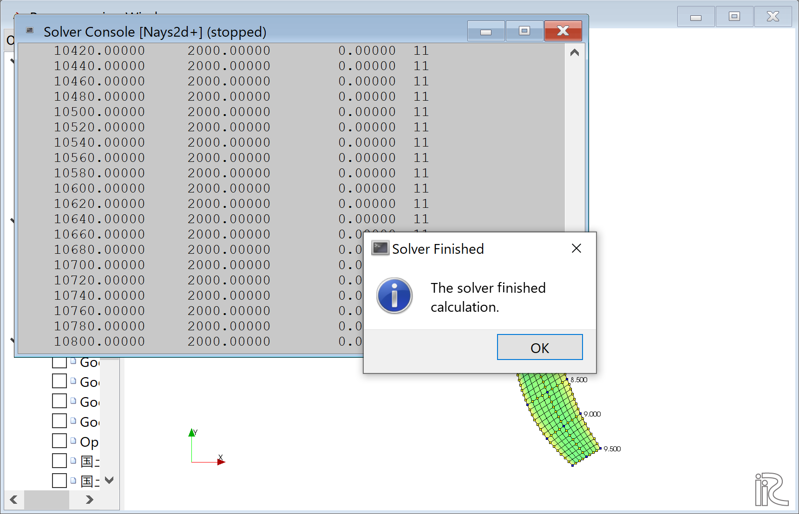

   :Calculation finished

-------------------------------
Display Computational Results
-------------------------------

After the companion finished, form the main menu, 
by selecting [Calculation Results] and 
[Open new 2D Post-Processing Window], 
a new Window appears as :numref:`04_kekka_01` .

.. _04_kekka_01:

.. figure:: images/04/kekka_01.png
   :width: 400pt

   :2D Post-Process Window

^^^^^^^^^^^
Depth
^^^^^^^^^^^
n the object browser, put the check marks in "Scalar (node)" and "Depth[m]",
right-click and select "Properties". 
The "Scalar Setting" window :numref:`04_kekka_04` appears.

.. _04_kekka_04:

.. figure:: images/04/kekka_04.png
   :width: 250pt

   :Scalar Setting
 
Set the values as shown in :numref:`04_kekka_04`, and click [OK], 
then :numref:`04_kekka_05`
appears.

.. _04_kekka_05:

.. figure:: images/04/kekka_05.png
   :width: 450pt

   : Depth Plot

^^^^^^^^^^^^^^^^^^^^^^^^^^
Display Background Image
^^^^^^^^^^^^^^^^^^^^^^^^^^

Select from the main menu, [File]->[Property]
( :numref:`04_haikei_01` )

.. _04_haikei_01:

.. figure:: images/04/haikei_01.png
   :width: 400pt

   :Select Property

From the "Project Property" window, click 
[Edit] at [Coordinate System] 
.. _04_haikei_02:

   :Edit Coordinate System Setting

Input "Japan" in the [Search] window, and chose the one with "XII"
from the items with [EPSG:....] as :numref:`04_haikei_03` .
See more detail on coordinate system of Japan at
http://www.gsi.go.jp/sokuchikijun/jpc.html 

.. _04_haikei_03:

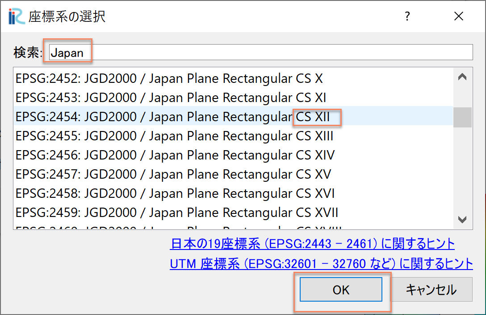

   :Select Coordinate System

Click [Close] of [Project Property] window of :numref:`04_haikei_04` 

.. _04_haikei_04:

.. figure:: images/04/haikei_04.png
   :width: 300pt

   :Close Property Window

Put a check mark in a box in front of [Background Images(Internet)] and
one of the items listed below, e.g., [Google Map (Sattelite Image)]
as :numref:`04_haikei_05`

.. _04_haikei_05:

.. figure:: images/04/haikei_05.png
   :width: 400pt

   :Background Image Import Complete

^^^^^^^^^^^^^^^^^^^^^^^^^^^^^^^^^^^
Velocity Vectors and Streamlines
^^^^^^^^^^^^^^^^^^^^^^^^^^^^^^^^^^^

Since the operation method is the same as the previous section, 
it will be omitted.

^^^^^^^^^^^^^^^^^^^^^^^^^^^^^^^^^
Particle Animations
^^^^^^^^^^^^^^^^^^^^^^^^^^^^^^^^^

Put check mark at [Particles] and [Velocity] in the object browser,
put time bar back to zero, and push black button, 
( :numref:`04_particle_01` ). 
Particle following the depth averaged velocity starts as 
:numref:`04_particle_02` ．

.. _04_particle_01:

.. figure:: images/04/particle_01.png
   :width: 400pt

   :Particle Animation

.. _04_particle_02:

.. figure:: images/04/particle_02.gif
   :width: 400pt

   :Particle movement by depth averaged velocity

表面流速に乗ったパーティクルを赤色で表示する．
「パーティクル」「SurfaceVelocity」に☑を入れて，「パーティクル」を右クリックして
「プロパティ」を選択すると，「パーティクル設定画面」 :numref:`04_particle_03` 
が表示されるので，図のように設定して[OK]をクリックする．
タイムバーをゼロに戻して，プレイボタンを押すと :numref:`04_particle_04` の
表面流によるパーティクルアニメーションが表示される．

.. _04_particle_03:

.. figure:: images/04/particle_03.png
   :width: 250pt

   :パーティクル設定

.. _04_particle_04:

   :表面流速によるパーティクル

同様な手続きで，「BottomVelocity」を選択すると，底面流によるパーティクルを表示出来る．

.. _04_particle_05:

.. figure:: images/04/particle_05.gif
   :width: 400pt

   :底面流速によるパーティクル

