[計算例 4] 実河川における準3次元流れの計算（単断面)
============================================================================

---------------
ソルバーの選択
---------------
メニュー画面で、「ファイル」「ソルバの選択」で表示される :numref:`04_koshi_1` 
で「Nays2d+」を選択して「OK」をクリックする。

.. _04_koshi_1:

.. figure:: images/04/koshi_1.png
   :width: 250pt

   : ソルバーの選択

-----------------------------------------
河床高標高データ（横断データ）の読み込み
-----------------------------------------

:numref:`04_koshi_2` で「インポート」「河床高」を選択する。

.. _04_koshi_2:

.. figure:: images/04/koshi_2.png
   :width: 250pt

   : 河床高ファイル(rivファイル)のインポート

:numref:`04_koshi_3` で、「single.riv」を選択して[開く]。（single.rivは、
https://i-ric.org/yasu/fw/rivfiles/single.riv からダウンロードして
ローカルに保存しておくこと）。

.. _04_koshi_3:

.. figure:: images/04/koshi_3.png
   :width: 250pt

   : ファイルの選択

:numref:`04_koshi_4` のように「問題が見つかりました」と出るが、構わず[OK]をクリックして
続ける。 

.. _04_koshi_4:

.. figure:: images/04/koshi_4.png
   :width: 250pt

   : 見つかった問題

:numref:`04_koshi_5`  「河川測量データインポート設定」 のウィンドウで、
「左岸と右岸の中点」を選択して[OK]をクリック

.. _04_koshi_5:

.. figure:: images/04/koshi_5.png
   :width: 250pt

   : 河川測量データインポート設定

:numref:`04_koshi_6` rivファイルのインポートが完了する。
なお、実際の河川のrivfileは横断測量断面そのままの場合、断面どうしの交差の回避や不要部分の
無効化など様々な編集が必要となるが、ここでは編集済みのもの用意してある。実際はそれぞれの
状況に応じた対応が必要となる。

.. _04_koshi_6:

   : インポート完了

-------------------------
格子の生成条件の設定
-------------------------

:numref:`04_koshi_7` のメニュー画面で、「格子」「格子生成アルゴリズムの選択」を選ぶ

.. _04_koshi_7:

.. figure:: images/04/koshi_7.png
   :width: 450pt

   : 格子生成アルゴリズムの選択

:numref:`04_koshi_8` 「格子アルゴリズムの選択」画面で、「河川測量データから生成」を選んで[OK]をクリック

.. _04_koshi_8:

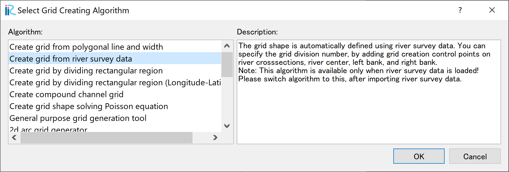

   : 河川測量データから生成

:numref:`04_koshi_9` 格子生成条件設定完了。各横断線の両端とセンターに青丸が表示された画面となる。

.. _04_koshi_9:

.. figure:: images/04/koshi_9.png
   :width: 450pt

   : 格子生成条件設定終了

-------------------------
格子の生成
-------------------------

横断線のうちの一つ（どれでも良い）を選択し、左右岸どちらでも良いので右クリックして、
「分割点の追加(A)」を選択する。

.. _04_koshi_10:

.. figure:: images/04/koshi_10.png
   :width: 450pt

   :分割点の追加(1)

「分割数」ここでは[4]（中央から半分の断面を4分割するという意味）を指定して[OK]をクリック。

.. _04_koshi_11:

   :分割点の追加(2)

:numref:`04_koshi_10` で選択したのと反対側の横断線を選んで、右クリックし、
「分割点の追加(A)」を選択する。

.. _04_koshi_12:

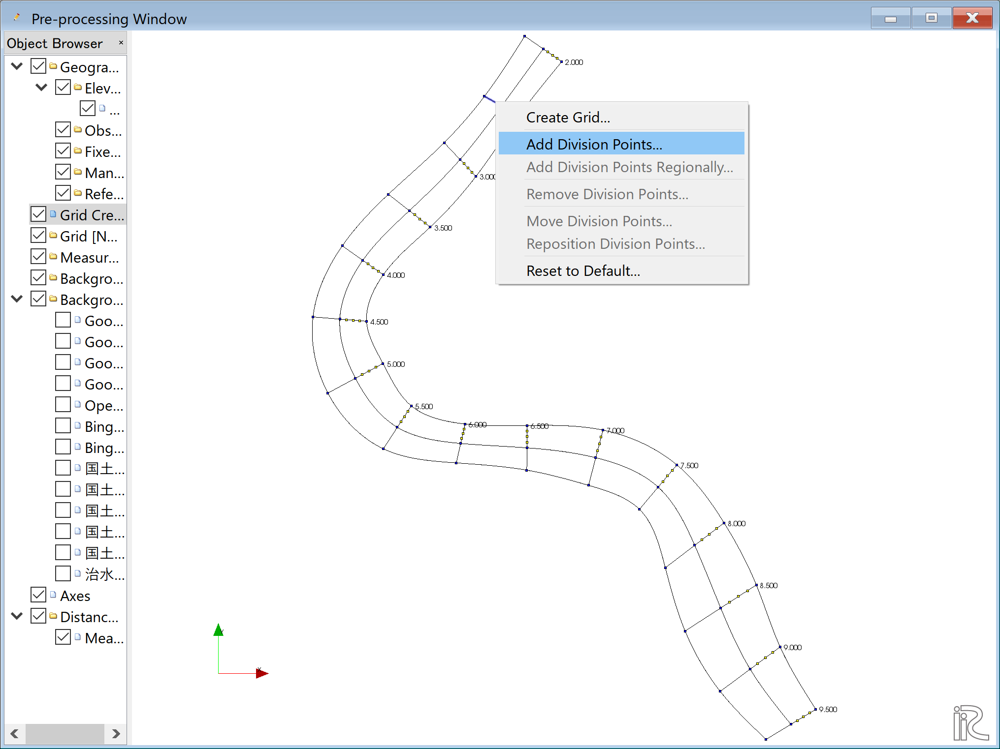

   :分割点の追加(3)

「分割数」ここでは[4] :numref:`04_koshi_11` で指定したのと同じく
左右岸対称の分割数とする。 

.. _04_koshi_13:

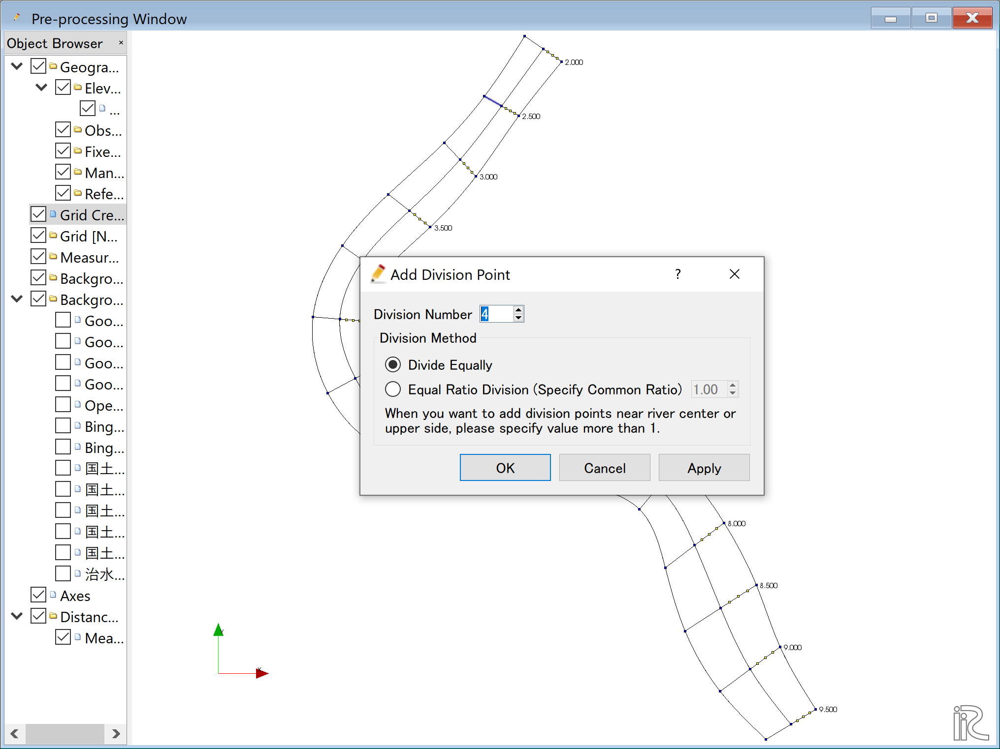

   :分割点の追加(4)

縦断方向の分割数は一括して指定する。メニューバーから「格子」「格子生成条件」
「分割点の一括追加」を選択

.. _04_koshi_14:

.. figure:: images/04/koshi_14.png
   :width: 450pt

   :分割点の一括追加(1)

「目標とする分割点間の距離」を選び、ここでは[70]mを指定して、[OK]をクリック。

.. _04_koshi_15:

.. figure:: images/04/koshi_15.png
   :width: 450pt

   :分割点の一括追加(2)

分割点の設定が完了。縦横断方向の分割点に黄色の〇が付いた平面図が表示される。

.. _04_koshi_16:

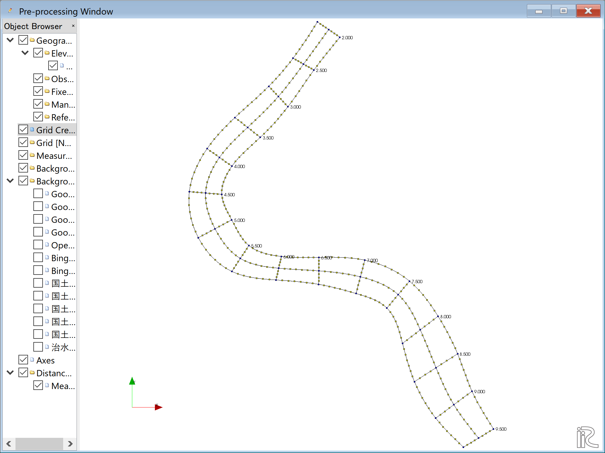

   :分割点の設定完了

メニューバーの「格子」「格子生成」を選ぶ。

.. _04_koshi_17:

.. figure:: images/04/koshi_17.png
   :width: 450pt

   :格子生成(1)

格子生成範囲が青で塗られて、範囲の距離標を示すウィンドウが現れるので、確認して
[OK]をクリックする。

.. _04_koshi_18:

.. figure:: images/04/koshi_18.png
   :width: 450pt

   :格子生成(2)

「マッピングを実行しますか？」と出るので[OK]をクリックする。

.. _04_koshi_19:

   :マッピングの実行確認

格子生成が完了し、格子が表示される。

.. _04_koshi_20:

.. figure:: images/04/koshi_20.png
   :width: 450pt

   :格子生成の完了

オブジェクトブラウザーの「格子」「格子点の属性」「河床高(m)」に☑マークを入ると、
格子平面図に標高がカラーコンターで表示され、マッピングの結果が確認出来る。

.. _04_koshi_21:

.. figure:: images/04/koshi_21.png
   :width: 450pt

   :マッピング結果の確認

------------------------
計算条件の設定
------------------------

メニューの「計算条件」「設定」を選ぶ

.. _04_joken_01:

.. figure:: images/04/joken_01.png
   :width: 450pt

   :計算条件の設定

「グループ」「流量および下流端水位の設定」で、「流量を与える時間単位」を[時間]とし、
[Edit]をクリックする。

.. _04_joken_02:

   :流量の設定(1)

:numref:`04_joken_03` で3時間の一定流量[2,000㎥/s]を設定して[OK]をクリックする。

.. _04_joken_03:

.. figure:: images/04/joken_03.png
   :width: 300pt

   :流量の設定(2)

「時間および浸食に関するパラメーター」は下図ように設定する。

.. _04_joken_04:

.. figure:: images/04/joken_04.png
   :width: 400pt

   :時間および浸食に関するパラメーター

「3次元流速分布」に関しては下図のように設定して。[保存して閉じる]を選択して終了

.. _04_joken_05:

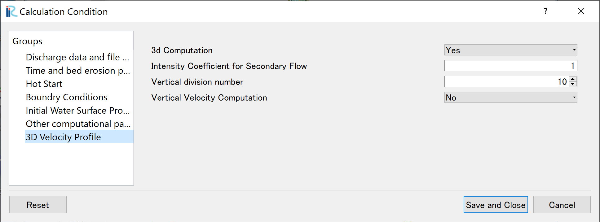

   :3次元流速分布の設定

-------------
計算の実行
-------------

メニューバーで、「計算」「実行」を選択

.. _04_jikko_01:

   :計算の実行(1)

「プロジェクトを保存しますか？」と聞かれるので、「はい(Y)」を選んで、適当な名前で保存する。

.. _04_jikko_02:

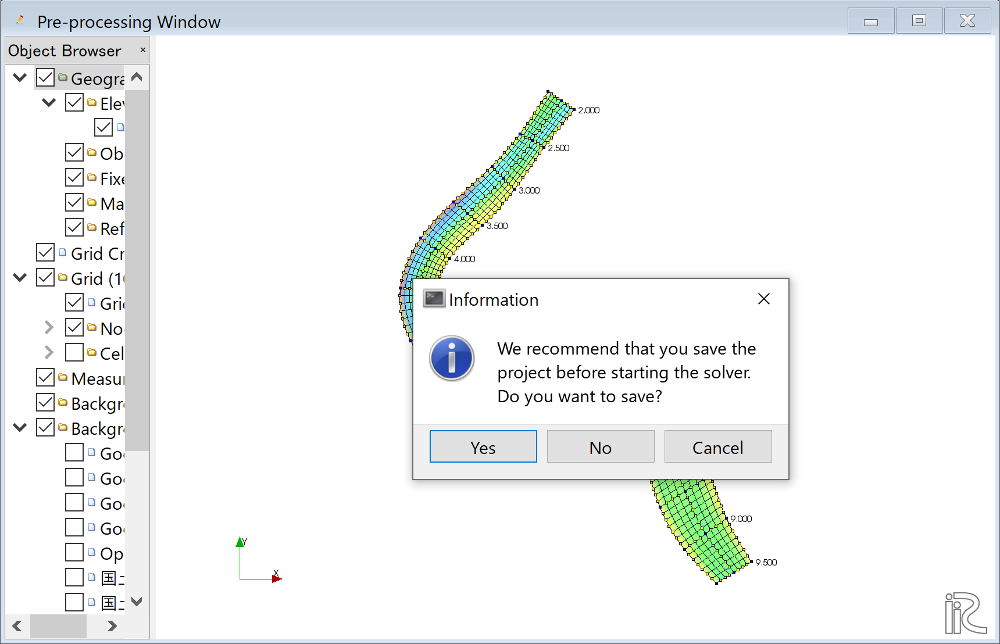

   :計算の実行(2)

計算が開始される。

.. _04_jikko_03:

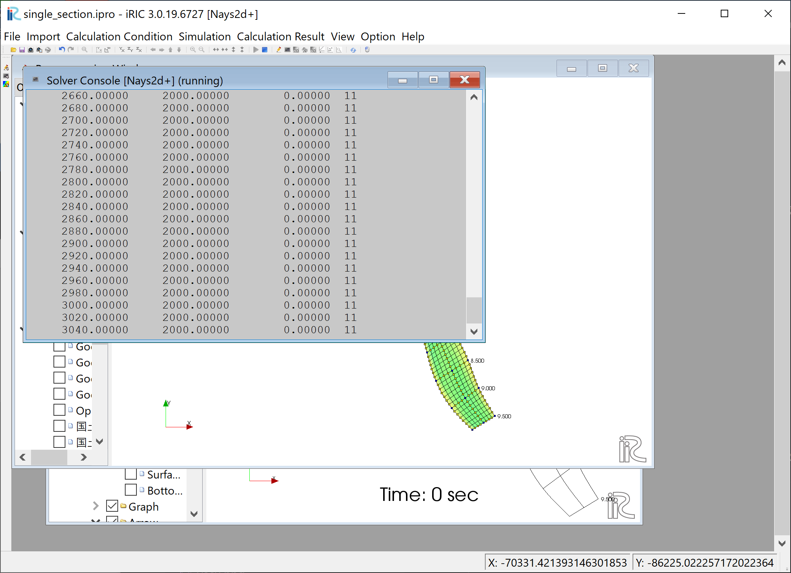

   :計算の実行(3)

「計算が終了しました。」と出るので、[OK]をクリックする。

.. _04_jikko_04:

.. figure:: images/04/jikko_04.png
   :width: 400pt

   :計算の終了

---------------
計算結果の表示
---------------

メニューで「計算結果」「新しい可視化ウィンドウ(2D)を開く」を選択する。

.. _04_kekka_01:

.. figure:: images/04/kekka_01.png
   :width: 400pt

   :新しい可視化ウィンドウ(2D)を開く

可視化ウィンドウが表示されるので、サイズを適当に変更して見やすい状態にする。

.. _04_kekka_02:

.. figure:: images/04/kekka_02.png
   :width: 400pt

   :新しい可視化ウィンドウ(2D)の表示

^^^^^^^^^^^
水深の表示
^^^^^^^^^^^

:numref:`04_kekka_03` のように。オブジェクトブラウザーで、
「スカラー（格子点）」「Depth(m)」
に☑マークを入れて、[Depth(m)]を右クリックで「プロパティ」を選択すると、
「スカラー設定ウィンドウ」 :numref:`04_kekka_04` が表示される。

.. _04_kekka_03:

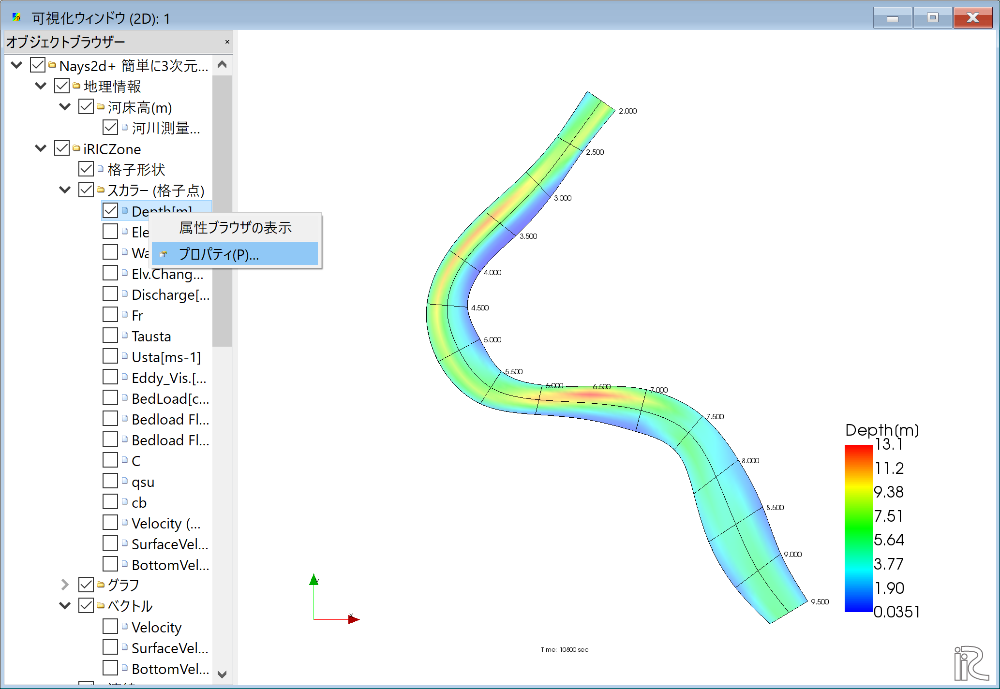

   :新しい可視化ウィンドウ(2D)の表示

.. _04_kekka_04:

.. figure:: images/04/kekka_04.png
   :width: 300pt

   :スカラー設定

「スカラー設定ウィンドウ」 :numref:`04_kekka_04` を図のように設定して[OK]をクリックすると、
水深コンターが表示される。

.. _04_kekka_05:

   :水深コンター図

^^^^^^^^^^^^^^^
背景画像の表示
^^^^^^^^^^^^^^^

「ファイル」「プロパティ」を選択する。

.. _04_haikei_01:

   :ファイルのプロパティ選択

「プロジェクトプロパティ」で「座標系」の「編集」を選択する。

.. _04_haikei_02:

.. figure:: images/04/haikei_02.png
   :width: 300pt

   :座標系の編集

「座標系の選択」画面で、「検索」に[Japan]と入れると、「EPSG.......」というのが沢山出てくるので、
その中で、末尾が「XII」のものを選んで[OK]をクリックする。
（日本の座標系については、
http://www.gsi.go.jp/sokuchikijun/jpc.html
を参照されたい。）

.. _04_haikei_03:

.. figure:: images/04/haikei_03.png
   :width: 300pt

   :座標系の選択

「プロジェクトプロパティ」ウィンドウを[閉じる]

.. _04_haikei_04:

.. figure:: images/04/haikei_04.png
   :width: 300pt

   :プロジェクトプロパティウィンドウを閉じる

オブジェクトブラウザーで、「背景画像（インターネット）」「国土地理院（標準地図）」
に☑マークを入れると、背景地図が読み込まれ、表示される。

.. _04_haikei_05:

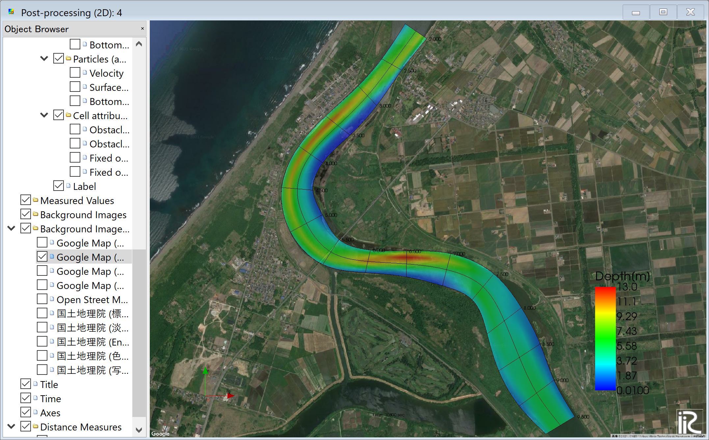

   :背景画像の読み込み完了

背景を写真にしたい場合や、他の種類の地図にしたい場合は、別の項目を☑する。
なお、GUIの操作時に常時背景画像を表示させておくと、操作が非常に重くなるので、
通常は「背景画像」の☑マークを外しておくことを推奨する。

^^^^^^^^^^^^^^^^^^^^
ベクトルと流線の表示
^^^^^^^^^^^^^^^^^^^^

操作方法、表示方法は全章の例と全く同じなので、省略する。

^^^^^^^^^^^^^^^^^^^^^^^^^^^^^^^^^
パーティクルアニメーションの表示
^^^^^^^^^^^^^^^^^^^^^^^^^^^^^^^^^

オブジェクトブラウザーの「パーティクル」「Velocity」に☑マークを付けて、
タイムバーをゼロに戻し、プレイボタンを押す（ :numref:`04_particle_01` )と
:numref:`04_particle_02` の水深平均流速によるパーティクルアニメーションが始まる。

.. _04_particle_01:

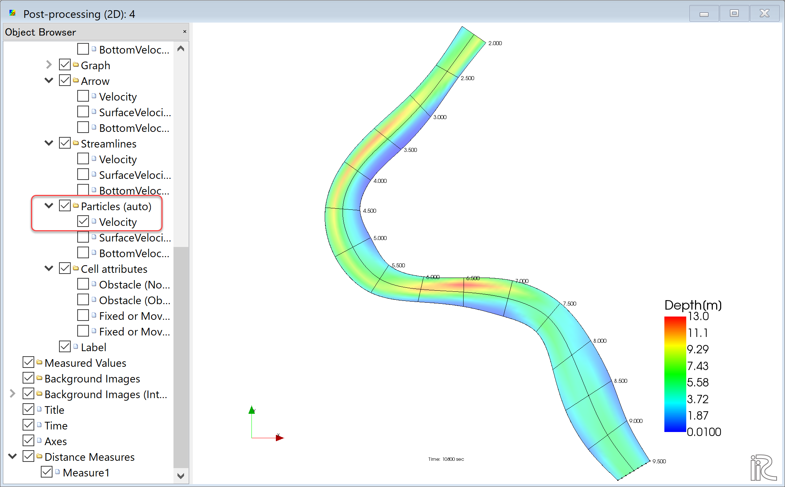

   :パーティクルアニメーション

.. _04_particle_02:

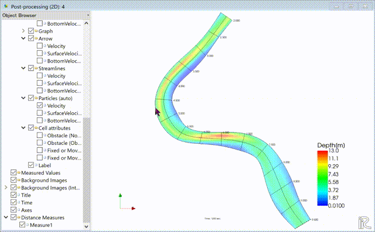

   :水深平均流速によるパーティクル

表面流速に乗ったパーティクルを赤色で表示する。
「パーティクル」「SurfaceVelocity」に☑を入れて、「パーティクル」を右クリックして
「プロパティ」を選択すると、「パーティクル設定画面」 :numref:`04_particle_03` 
が表示されるので、図のように設定して[OK]をクリックする。
タイムバーをゼロに戻して、プレイボタンを押すと :numref:`04_particle_04` の
表面流によるパーティクルアニメーションが表示される。

.. _04_particle_03:

.. figure:: images/04/particle_03.png
   :width: 250pt

   :パーティクル設定

.. _04_particle_04:

.. figure:: images/04/particle_04.gif
   :width: 400pt

   :表面流速によるパーティクル

同様な手続きで、「BottomVelocity」を選択すると、底面流によるパーティクルを表示出来る。

.. _04_particle_05:

   :底面流速によるパーティクル

