[Example 5] Flow in a Real River (Compound Cross section)
============================================================================

----------------
Select Solver
----------------

In the [Select Solver] window, :numref:`05_koshi_1` ,
select [Nays2d+] and click [OK].

.. _05_koshi_1:

.. figure:: images/05/koshi_1.png
   :width: 100%

   : Select Solver

-----------------------------------------
Importing River Survey Data
-----------------------------------------

In the window, :numref:`05_koshi_2`, select [Import], [Geographic Data], 
[Elevation(m)]

.. _05_koshi_2:

.. figure:: images/05/koshi_2.png
   :width: 100%

   : Import river geographic data

Chose [compound.riv] in the window, :numref:`05_koshi_3` and open.
The cross sectional survey data "compound.riv" can be downloaded from，
https://i-ric.org/yasu/fw/rivfiles/compound.riv 

.. _05_koshi_3:

.. figure:: images/05/koshi_3.png
   :width: 100%

   : Select File

A message window may appear telling "Problems Fund i Data" as 
:numref:`05_koshi_4` ,but just click [OK]

.. _05_koshi_4:

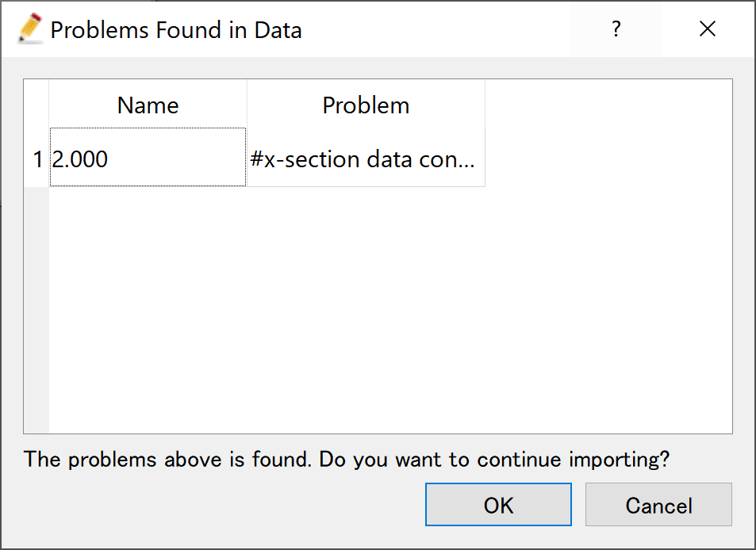

   : Problem Fund

Select [Middle point of left and right bank] in the 
[River Survey Data Import Setting] window as :numref:`05_koshi_5` ,
and click [OK]

.. _05_koshi_5:

.. figure:: images/05/koshi_5.png
   :width: 100%

   : River Survay Data Import Setting

:numref:`05_koshi_6` riv file import complete.

.. _05_koshi_6:

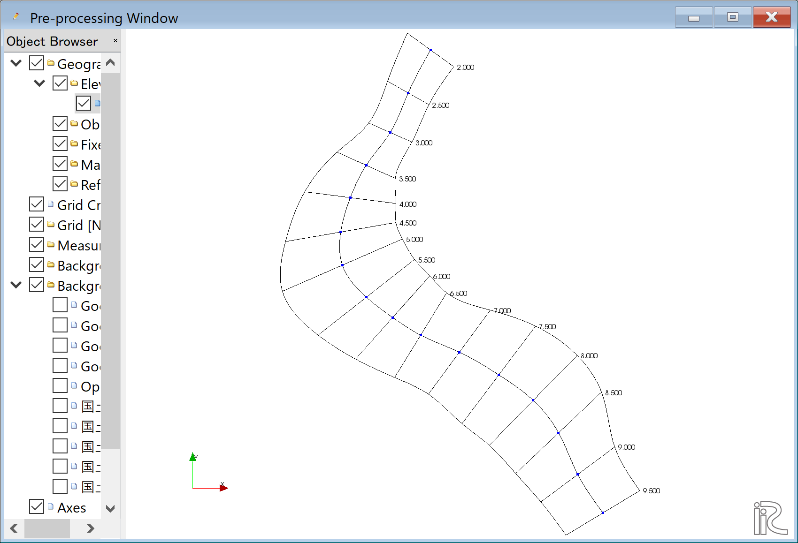

   : Import Complete

-------------------------
Moving centerline
-------------------------

As shown in :numref:`05_koshi_7` , move the centerline of the channel 
close to approximate center of the low water channel.  

.. _05_koshi_7:

.. figure:: images/05/koshi_7.gif
   :width: 100%

   : Moving Centerline

-----------------------------
Grid Generation Conditions
-----------------------------

From the main menu, select [Grid] and [Select Algorithm to Create Grid] as, 
:numref:`05_koshi_80` 

.. _05_koshi_80:

.. figure:: images/05/koshi_80.png
   :width: 100%

   : Select Algorithm to Create Grid

Select [Create grid from river survey data] from the window, :numref:`05_koshi_8` ,
and click [OK].

.. _05_koshi_8:

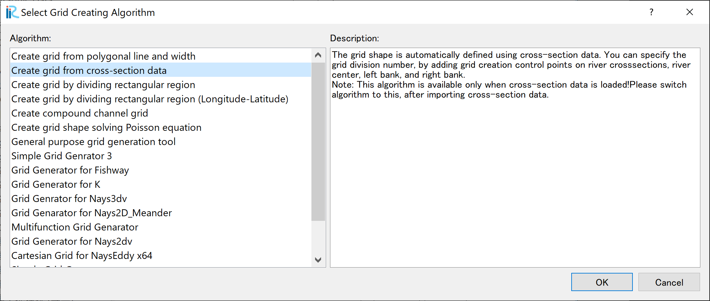

   :Create grid from river survey data

As shown in :numref:`05_koshi_9` , a channel with cross sections with both ends' 
blue circles are displayed.

.. _05_koshi_9:

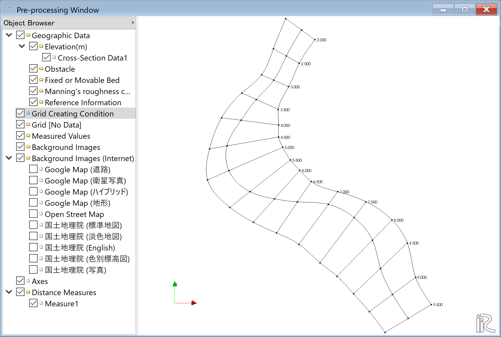

   : Setting Grid Create Condition Complete

-------------------------
Grid Generation
-------------------------

Select any side of one of the cross section line, right click, and chose
[Add Division Points].

.. _05_koshi_10:

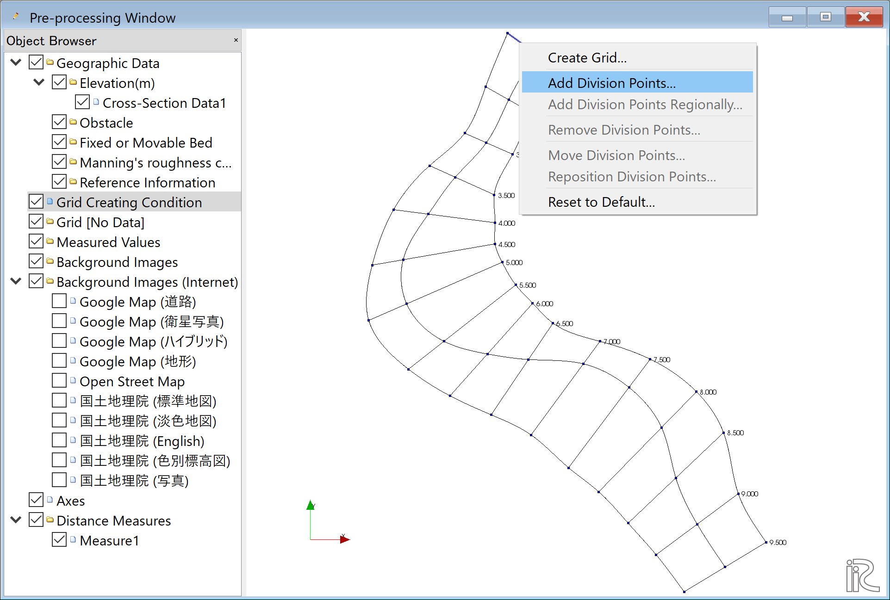

   :Add Division Points(1)

Set [Division Number], set [8] in this example, and
click [OK] (:numref:`05_koshi_11` )

.. _05_koshi_11:

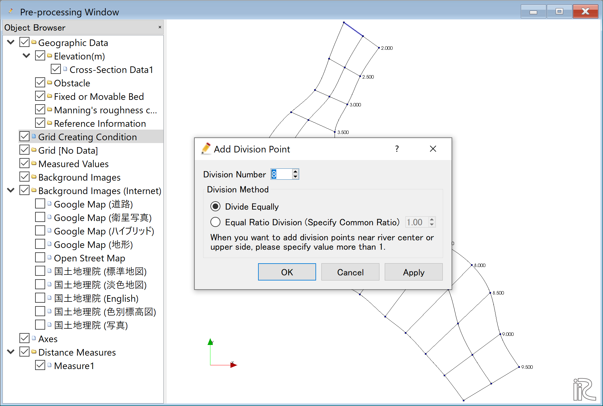

   :Add Division Points(2)

Select one of the opposite side of the cross sectional line we 
selected in :numref:`05_koshi_10` , right click, and chose
[Add Division Points] (:numref:`05_koshi_12` )

.. _05_koshi_12:

.. figure:: images/05/koshi_12.png
   :width: 100%

   :Add Division Points(3)

Set [Division Number], set [8] as a same number we set in 
:numref:`05_koshi_11` for the symmetry.

.. _05_koshi_13:

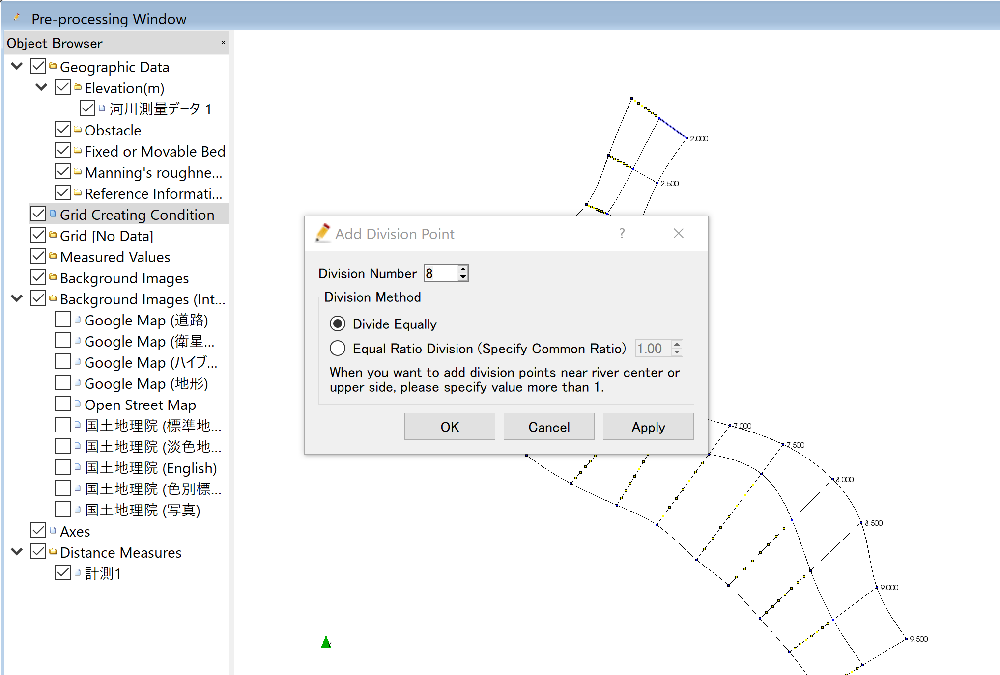

   :Add Division Points(4)

Along the channel direction, division points are set all at once.
Select [Grid], [Add Division Points Regionally] from the menu bar.
( :numref:`05_koshi_14` )

.. _05_koshi_14:

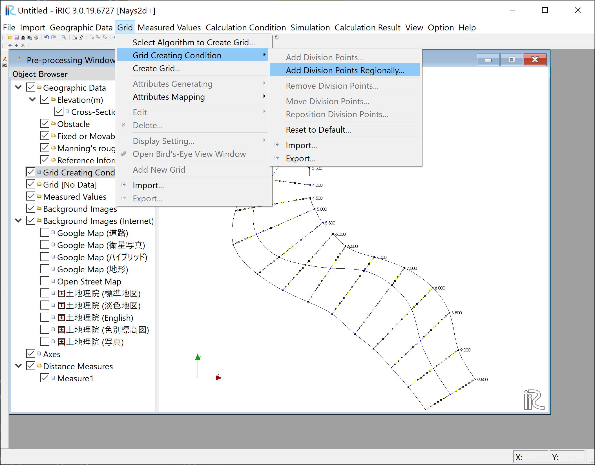

   :Add Division Points Regionally(1)

Chose [Specify target distance division points]. set distance [50] in this example,
and click [OK]．( :numref:`05_koshi_15` )

.. _05_koshi_15:

.. figure:: images/05/koshi_15.png
   :width: 60%

   :Add Division Points Regionally(2)

When the setup for division points are completed, 
a plane map with yellow circle points appears as
:numref:`05_koshi_16`

.. _05_koshi_16:

.. figure:: images/05/koshi_16.png
   :width: 100%

   :Set division points complete

Select [Grid], [Grid Create] from the menu bar.( :numref:`05_koshi_17` )

.. _05_koshi_17:

.. figure:: images/05/koshi_17.png
   :width: 100%

   :Grid Create(1)

Confirm the grid generation range painted with blue, and 
click [OK].

.. _05_koshi_18:

.. figure:: images/05/koshi_18.png
   :width: 100%

   :Grid Create(2)

Answer [Yes] when you asked [Do you want to map?] as
:numref:`05_koshi_19` 

.. _05_koshi_19:

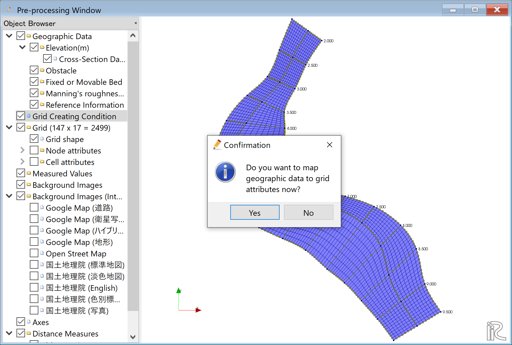

   :Mapping?

Completed grid is shown as :numref:`05_koshi_20` 

.. _05_koshi_20:

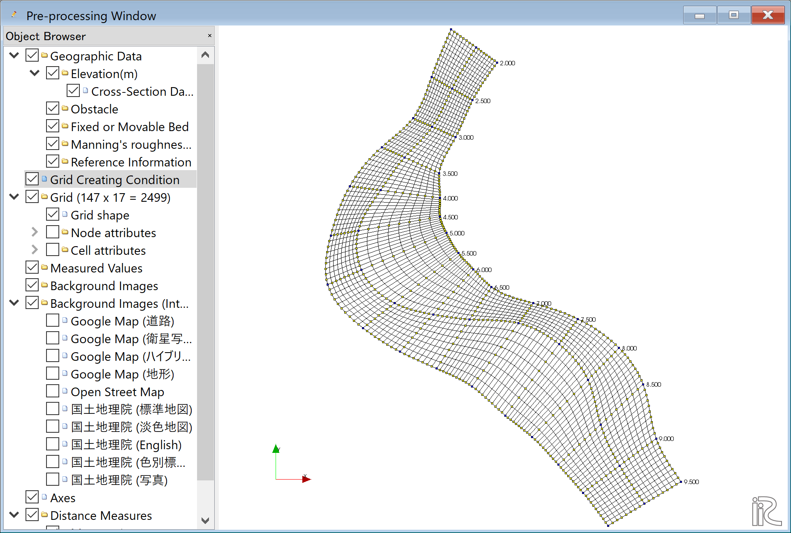

   :Grid Generation Complete

Bed configuration and channel shape can be confirmed by putting checking marks at, 
[Grid], [Node attributes] and [Elevation (m)].
( :numref:`05_koshi_21` )

.. _05_koshi_21:

.. figure:: images/05/koshi_21.png
   :width: 100%

   :Confirmation of the Mapping Result

-------------------------
Computational Condition
-------------------------

Select [Calculation Condition] and [Setting] from the min menu as
:numref:`05_joken_01` .

.. _05_joken_01:

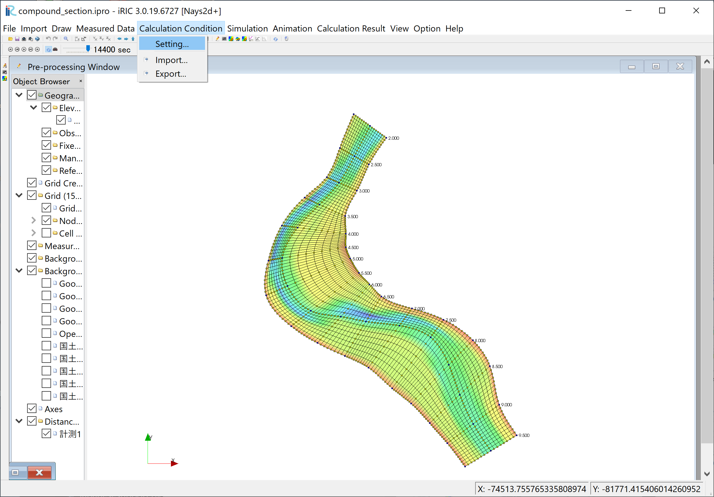

   :Setting Computational Condition

Set [Time unit of discharge] as [Hour] and click [Edit], 
( :numref:`05_joken_02` )

.. _05_joken_02:

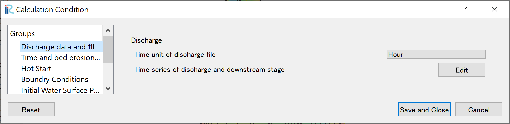

   :Discharge Condition

Set discharge hydrography as :numref:`05_joken_03`, constant for 3 hours 
with 2,000 qms, and click [OK].

.. _05_joken_03:

.. figure:: images/05/joken_03.png
   :width: 100%

   :Input Discharge(2)

Set [Time and bed erosion condition] as :numref:`05_joken_04` .

.. _05_joken_04:

.. figure:: images/05/joken_04.png
   :width: 100%

   :Time and bed erosion condition

Set [Boundary Conditions] as :numref:`05_joken_05` .

.. _05_joken_05:

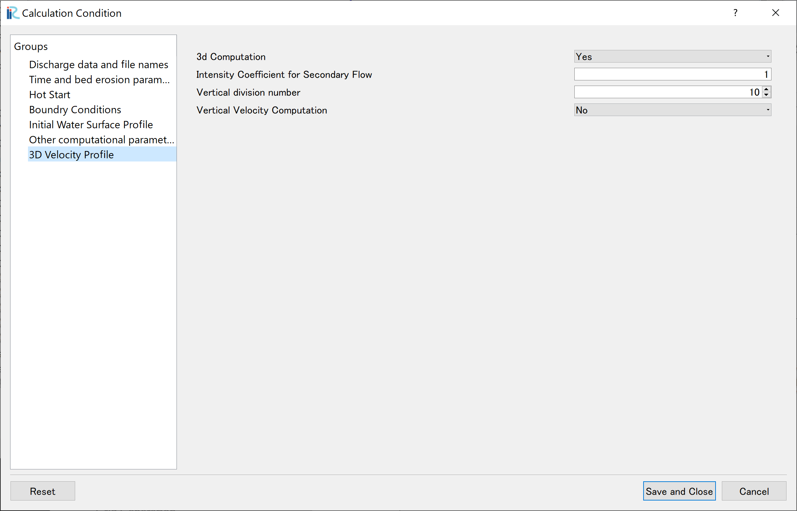

   :Boundary Conditions

Set [Initial Water Surface Profile] as :numref:`05_joken_06` .

.. _05_joken_06:

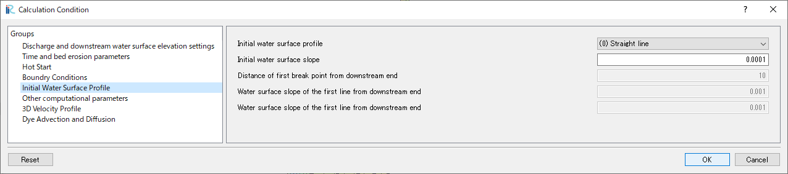

   :Initial Water Surface Profile

Set [Other computational parameters] as :numref:`05_joken_07` .

.. _05_joken_07:

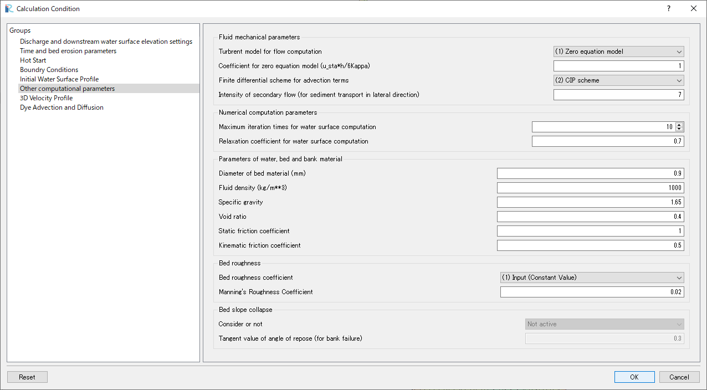

   :Other computational parameters

Set "3D Velocity Profile" as shown in the figure :numref:`05_joken_08` ,
and click [OK] to exit.

.. _05_joken_08:

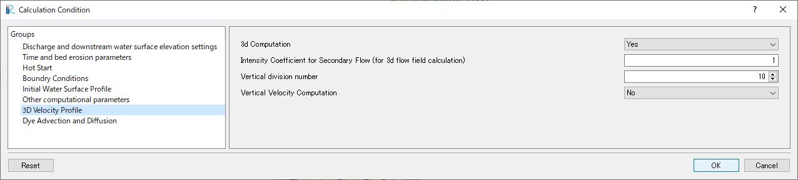

   :3D Velocity Profile Settings

--------------------
Launch Computation
--------------------

From the menu bar, select [Simulation] and [Run].

.. _05_jikko_01:

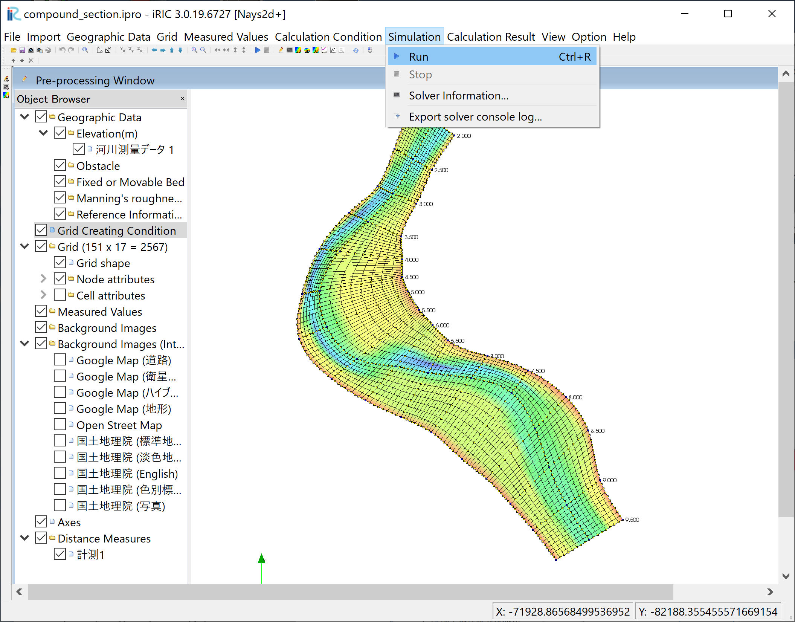

   :Launch Simulation(1)

Answer [Yes(Y)] when you asked [Save the project？] as
:numref:`05_jikko_02` 

.. _05_jikko_02:

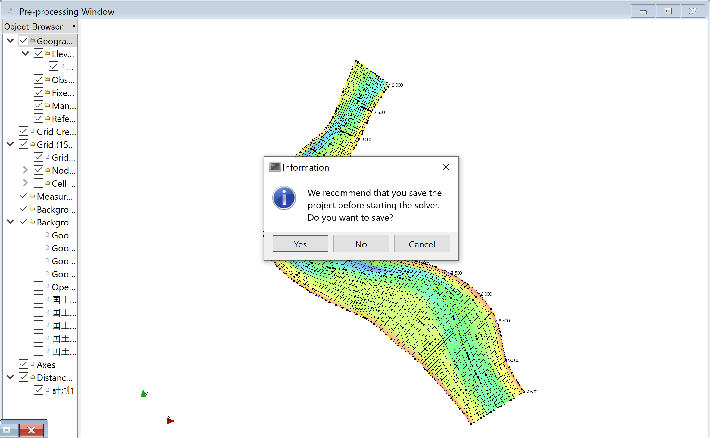

   :Launch Simulation(2)

Simulation starts. :numref:`05_jikko_03` 

.. _05_jikko_03:

.. figure:: images/05/jikko_03.png
   :width: 100%

   :Launch Simulation(3)

Click [OK] when the message [The solver finished calculation] as
:numref:`05_jikko_04` 

.. _05_jikko_04:

.. figure:: images/05/jikko_04.png
   :width: 60%

   :Calculation finished

-------------------------------
Display Computational Results
-------------------------------

After the companion finished, form the main menu, 
by selecting [Calculation Results] and 
[Open new 2D Post-Processing Window], 
a new Window appears as :numref:`05_kekka_01` .

.. _05_kekka_01:

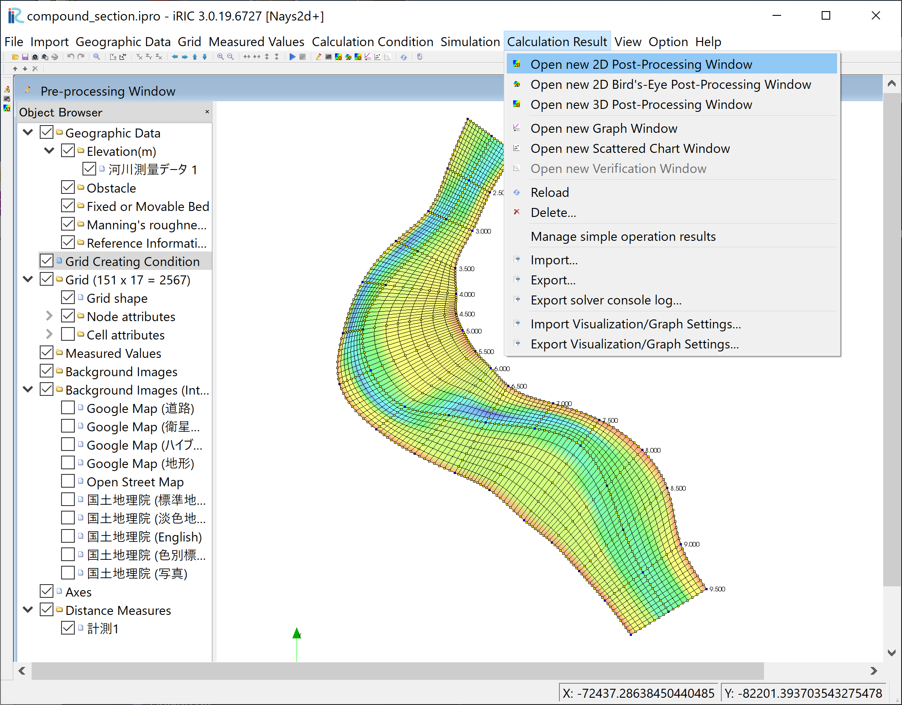

   :2D Post-Process Window

^^^^^^^^^^^
Depth
^^^^^^^^^^^

In the object browser, put the check marks in "Scalar (node)" and "Depth[m]",
right-click and select "Properties". 
The "Scalar Setting" window :numref:`05_kekka_04` appears.

.. _05_kekka_04:

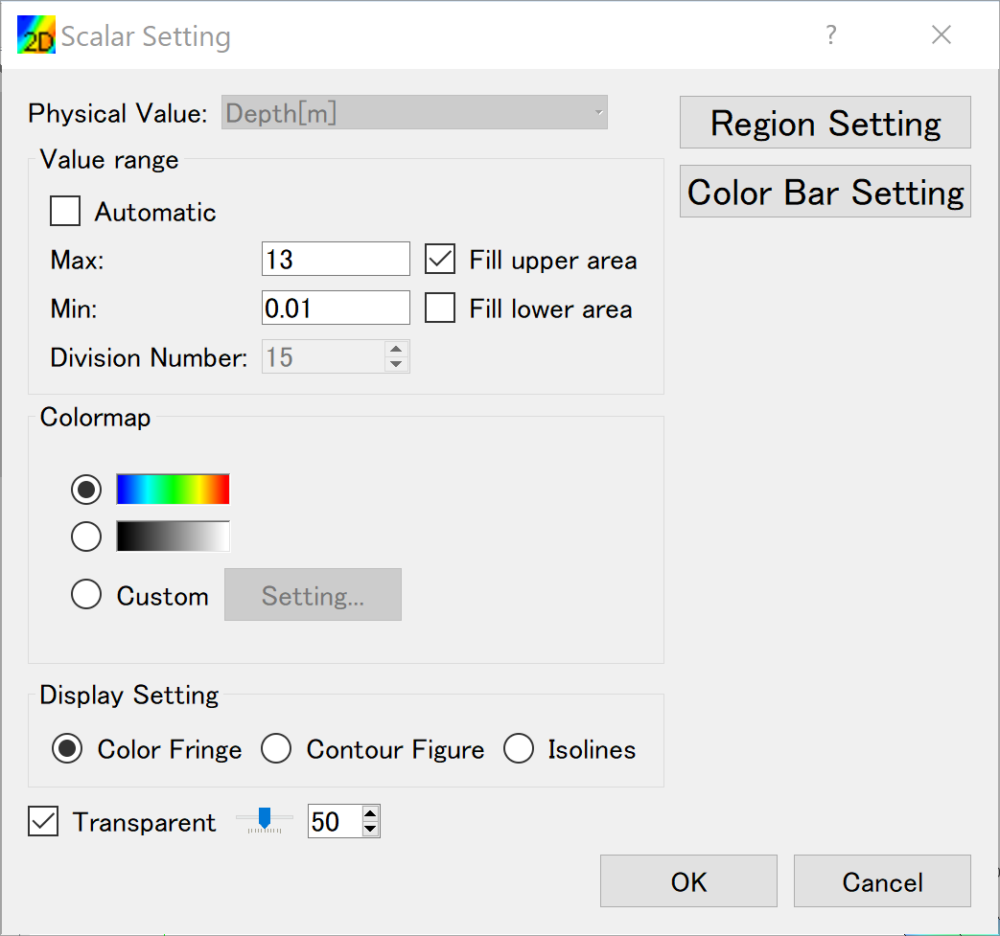

   :Scalar Setting
 
Set the values as shown in :numref:`05_kekka_04`, and click [OK], 
then :numref:`05_kekka_05`
appears.

.. _05_kekka_05:

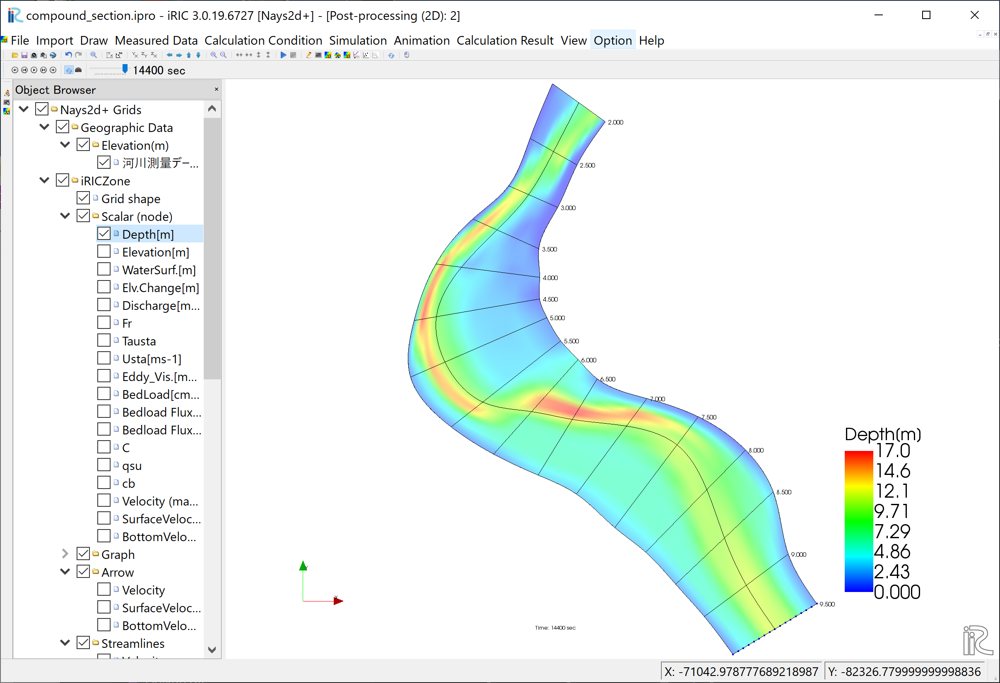

   : Depth Plot

^^^^^^^^^^^^^^^^^^^^^^^^^^
Display Background Image
^^^^^^^^^^^^^^^^^^^^^^^^^^

Background images can be imported from Internet resources by the method described in the 
previous section.  After setting the property of the coordinate system, 
put check marks in a box in front of [Background Images(Internet)] and
one of the items listed below, e.g., [Google Map (Satellite Image)], the background image
is imported and shown as :numref:`05_haikei_05`

.. _05_haikei_05:

.. figure:: images/05/haikei_05.png
   :width: 100%

   :Background Image Import Complete

^^^^^^^^^^^^^^^^^^^^^^^^^^^^^^^^^
Particle Animations
^^^^^^^^^^^^^^^^^^^^^^^^^^^^^^^^^

Particle animations can be played by the same procedure with the previous section.
:numref:`05_particle_02` shows the particle animation using the depth averaged velocity,
:numref:`05_particle_04` shows the particle animation using the surface velocity, 
and :numref:`05_particle_05` shows the particle animation using the bottom velocity.

.. _05_particle_02:

.. figure:: images/05/particle_02.gif
   :width: 100%

   :Particle movement by depth averaged velocity

.. _05_particle_04:

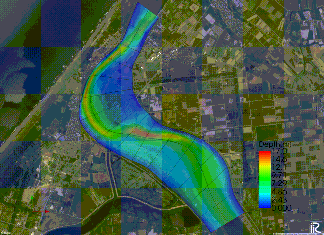

   :Particle movement by surface velocity

.. _05_particle_05:

.. figure:: images/05/particle_05.gif
   :width: 100%

   :Particle movement by bottom velocity

^^^^^^^^^^^^^^^^^^^^^^
Google Earth Output
^^^^^^^^^^^^^^^^^^^^^^

From the main menu bar, select [File], [Continuous Snapshot /Movie/Google Export]
as :numref:`05_kekka_06`

.. _05_kekka_06:

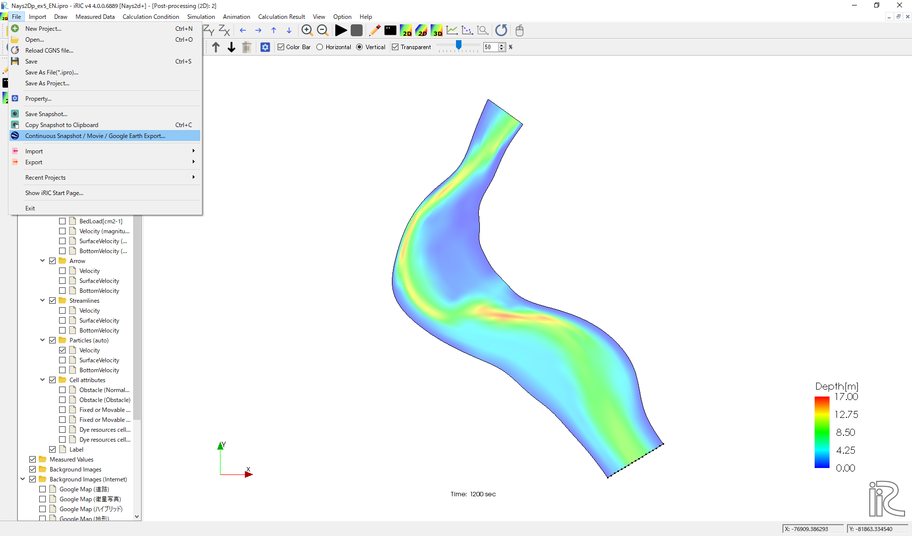

   :Animation Settings(1)

Chose [Next(N)] in :numref:`05_kekka_07`

.. _05_kekka_07:

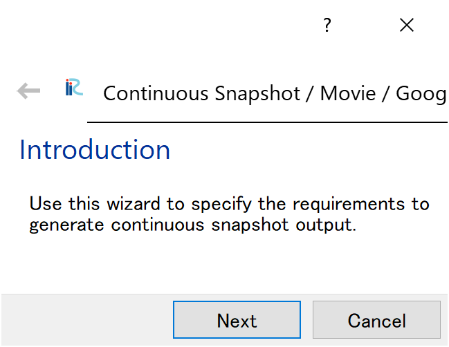

   :Animation Settings(2)

Chose [Next(N)] in :numref:`05_kekka_08`

.. _05_kekka_08:

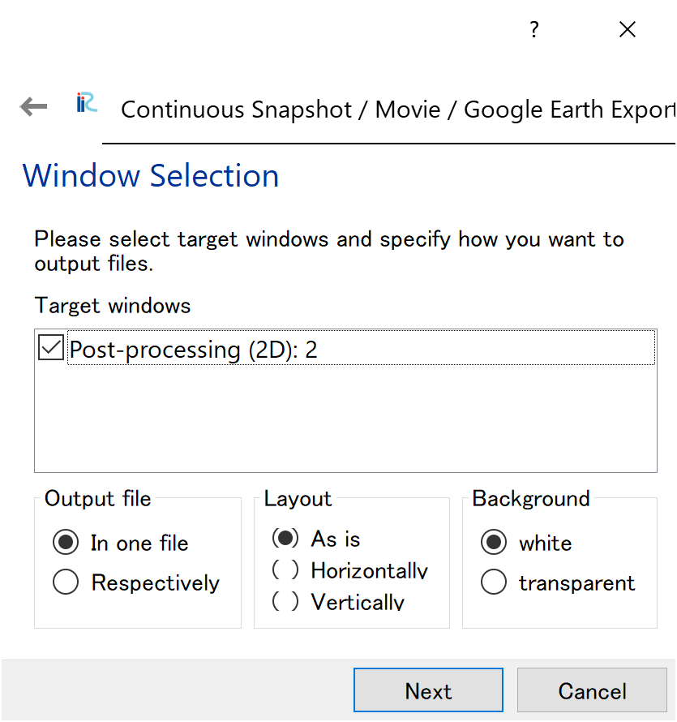

   :Animation Settings(3)

Chose [Next(N)] in :numref:`05_kekka_09`

.. _05_kekka_09:

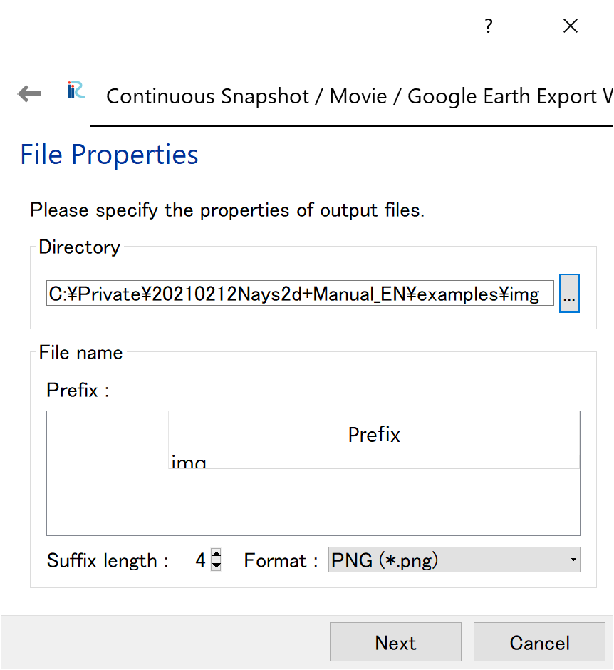

   :Animation Settings(4)

Put check mark at [Output movie files], and click [Next(N)] in :numref:`05_kekka_10`

.. _05_kekka_10:

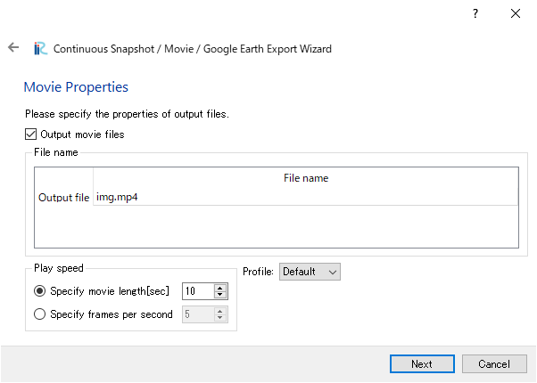

   :Animation Settings(5)

Set values as :numref:`05_kekka_11` and click [Next]

.. _05_kekka_11:

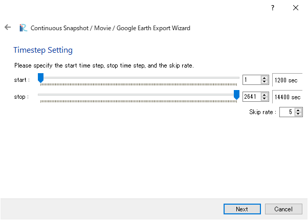

   :Animation Settings(6)

Put check mark at [Output to the Google Earth], click [Next] in :numref:`05_kekka_12`

.. _05_kekka_12:

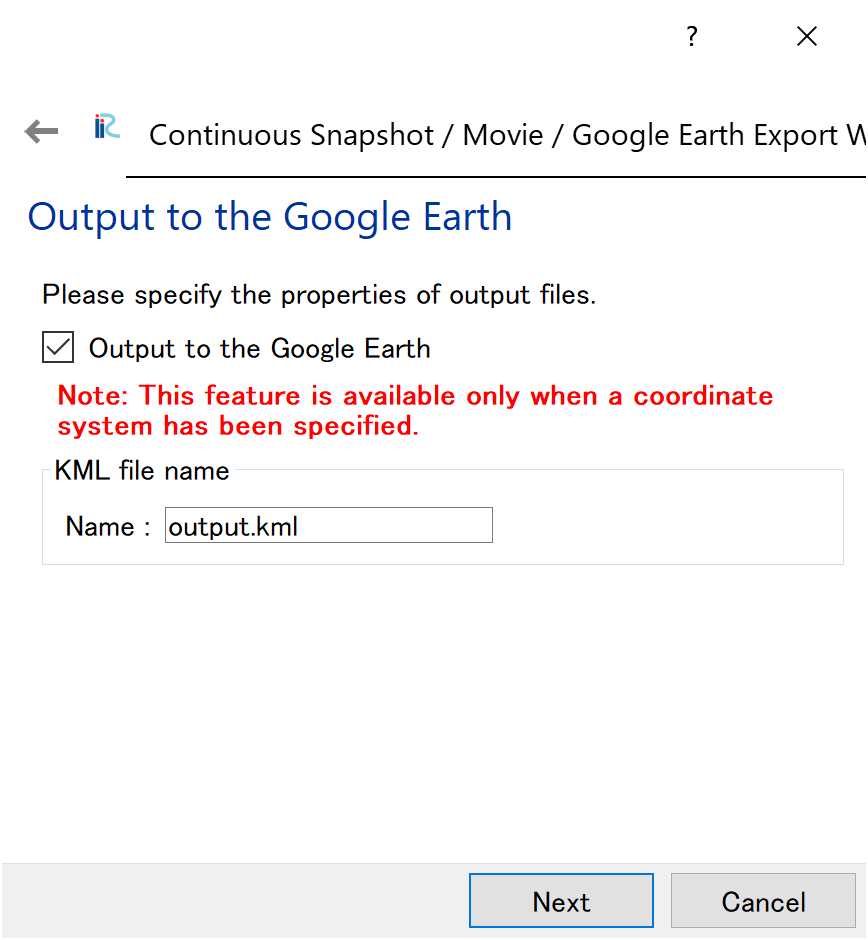

   :Animation Settings(7)

click [Finish] in :numref:`05_kekka_13`

.. _05_kekka_13:

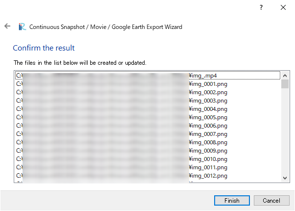

   :Animation Settings(8)

Then a file "output.kml" is generated.
You can now start playing by double clicking the "output.kml" 
as :numref:`05_particle_06`

.. _05_particle_06:

.. figure:: images/05/particle_06.gif
   :width: 100%

   :Google Earth Animation
